# Guide Complet - API Firebase Functions avec RBAC

## Schéma de la base de données Firestore

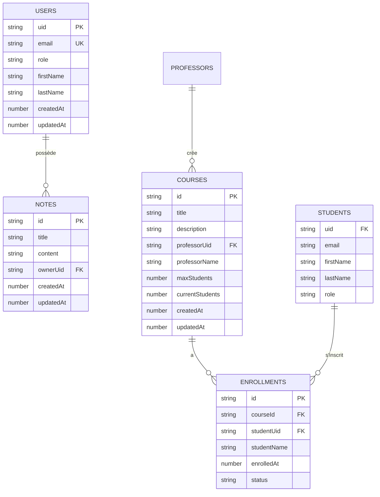
```mermaid
erDiagram
    USERS ||--o{ NOTES : "possède"
    PROFESSORS ||--o{ COURSES : "crée"
    COURSES ||--o{ ENROLLMENTS : "a"
    STUDENTS ||--o{ ENROLLMENTS : "s'inscrit"
    
    USERS {
        string uid PK
        string email UK
        string role
        string firstName
        string lastName
        number createdAt
        number updatedAt
    }
    
    COURSES {
        string id PK
        string title
        string description
        string professorUid FK
        string professorName
        number maxStudents
        number currentStudents
        number createdAt
        number updatedAt
    }
    
    STUDENTS {
        string uid FK
        string email
        string firstName
        string lastName
        string role
    }
    
    ENROLLMENTS {
        string id PK
        string courseId FK
        string studentUid FK
        string studentName
        number enrolledAt
        string status
    }
    
    NOTES {
        string id PK
        string title
        string content
        string ownerUid FK
        number createdAt
        number updatedAt
    }
```

### Collections Firestore (Vue Détaillée)

```
Collections Firestore:

users/
├── {uid}
│   ├── email: string
│   ├── role: "admin" | "professor" | "student"
│   ├── firstName: string
│   ├── lastName: string
│   ├── createdAt: number (timestamp)
│   └── updatedAt: number (timestamp)

courses/
├── {courseId}
│   ├── title: string
│   ├── description: string
│   ├── professorUid: string (référence à users)
│   ├── professorName: string
│   ├── maxStudents: number
│   ├── currentStudents: number
│   ├── createdAt: number
│   └── updatedAt: number

enrollments/
├── {enrollmentId}
│   ├── courseId: string (référence à courses)
│   ├── studentUid: string (référence à users)
│   ├── studentName: string
│   ├── enrolledAt: number
│   └── status: "active" | "completed" | "cancelled"

notes/
├── {noteId}
│   ├── title: string
│   ├── content: string
│   ├── ownerUid: string (référence à users)
│   ├── createdAt: number
│   └── updatedAt: number
```

---

## GUIDE - Les 3 Rôles

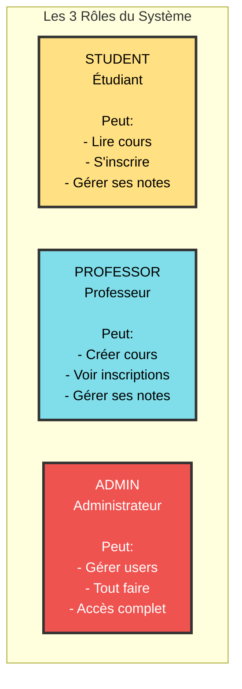
```mermaid
graph TB
    subgraph Roles["Les 3 Rôles du Système"]
        Student["STUDENT<br/>Étudiant<br/><br/>Peut:<br/>- Lire cours<br/>- S'inscrire<br/>- Gérer ses notes"]
        Professor["PROFESSOR<br/>Professeur<br/><br/>Peut:<br/>- Créer cours<br/>- Voir inscriptions<br/>- Gérer ses notes"]
        Admin["ADMIN<br/>Administrateur<br/><br/>Peut:<br/>- Gérer users<br/>- Tout faire<br/>- Accès complet"]
    end
    
    style Student fill:#FFE082,color:#000,stroke:#333,stroke-width:3px
    style Professor fill:#80DEEA,color:#000,stroke:#333,stroke-width:3px
    style Admin fill:#EF5350,color:#fff,stroke:#333,stroke-width:3px
```

---

## 1 – Commencer par créer 3 utilisateurs

### IMPORTANT : Démarrez d'abord les émulateurs Firebase

```bash
npm run serve
```

Attendez que vous voyiez :
```
All emulators ready! It is now safe to connect your app.
```

### Ouvrir Swagger UI

URL : http://localhost:5001/backend-demo-1/us-central1/api/docs/

---

### Utilisateur 1 - Admin

POST /v1/auth/signup

```json
{
  "email": "admin@school.com",
  "password": "admin123",
  "role": "admin",
  "firstName": "Sophie",
  "lastName": "Administrateur"
}
```

Réponse attendue : 201 Created

---

### Utilisateur 2 - Professor

POST /v1/auth/signup

```json
{
  "email": "prof.martin@school.com",
  "password": "prof123",
  "role": "professor",
  "firstName": "Jean",
  "lastName": "Martin"
}
```

Réponse attendue : 201 Created

---

### Utilisateur 3 - Student

POST /v1/auth/signup

```json
{
  "email": "student.dupont@school.com",
  "password": "student123",
  "role": "student",
  "firstName": "Marie",
  "lastName": "Dupont"
}
```

Réponse attendue : 201 Created

---

## 2 – Comment changer d'utilisateur et de rôle ?

### Processus de Connexion/Déconnexion

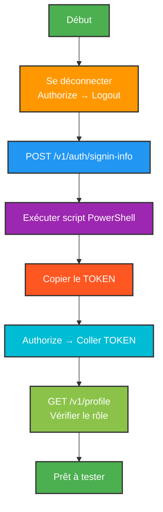
```mermaid
graph TB
    Start["Début"]
    Logout["Se déconnecter<br/>Authorize → Logout"]
    Login["POST /v1/auth/signin-info"]
    PowerShell["Exécuter script PowerShell"]
    Token["Copier le TOKEN"]
    Authorize["Authorize → Coller TOKEN"]
    Verify["GET /v1/profile<br/>Vérifier le rôle"]
    End["Prêt à tester"]
    
    Start --> Logout
    Logout --> Login
    Login --> PowerShell
    PowerShell --> Token
    Token --> Authorize
    Authorize --> Verify
    Verify --> End
    
    style Start fill:#4CAF50,color:#fff,stroke:#333,stroke-width:2px
    style Logout fill:#FF9800,color:#fff,stroke:#333,stroke-width:2px
    style Login fill:#2196F3,color:#fff,stroke:#333,stroke-width:2px
    style PowerShell fill:#9C27B0,color:#fff,stroke:#333,stroke-width:2px
    style Token fill:#FF5722,color:#fff,stroke:#333,stroke-width:2px
    style Authorize fill:#00BCD4,color:#fff,stroke:#333,stroke-width:2px
    style Verify fill:#8BC34A,color:#fff,stroke:#333,stroke-width:2px
    style End fill:#4CAF50,color:#fff,stroke:#333,stroke-width:2px
```

---

### Utilisateur 1 – admin@school.com (ADMIN)

#### Login

POST /v1/auth/signin-info

```json
{
  "email": "admin@school.com",
  "password": "admin123"
}
```

#### Instructions

La réponse contient un script PowerShell. Copiez-le et exécutez-le dans PowerShell pour obtenir le TOKEN.

#### Profil courant

GET /v1/profile

Authorization: Bearer {TOKEN_OBTENU}

Ou simplement allez en haut à droite dans Swagger et collez le TOKEN_OBTENU (MÉTHODE PRÉFÉRÉE)

---

### Utilisateur 2 – prof.martin@school.com (PROFESSOR)

#### Login

POST /v1/auth/signin-info

```json
{
  "email": "prof.martin@school.com",
  "password": "prof123"
}
```

#### Profil courant

GET /v1/profile

Authorization: Bearer {TOKEN_PROFESSOR}

Ou simplement allez en haut à droite dans Swagger et collez le TOKEN_OBTENU (MÉTHODE PRÉFÉRÉE)

---

### Utilisateur 3 – student.dupont@school.com (STUDENT)

#### Login

POST /v1/auth/signin-info

```json
{
  "email": "student.dupont@school.com",
  "password": "student123"
}
```

#### Profil courant

GET /v1/profile

Authorization: Bearer {TOKEN_STUDENT}

Ou simplement allez en haut à droite dans Swagger et collez le TOKEN_OBTENU (MÉTHODE PRÉFÉRÉE)

---

## 3 - Testez les endpoints du rôle ADMINISTRATEUR

### Utilisateur 1 – admin@school.com (ADMIN)

#### 3.1 - Login

POST /v1/auth/signin-info

```json
{
  "email": "admin@school.com",
  "password": "admin123"
}
```

#### 3.2 – Ajout du token à Swagger

Ou simplement allez en haut à droite dans Swagger et collez le TOKEN_OBTENU (MÉTHODE PRÉFÉRÉE)

#### 3.3 - Profil courant

GET /v1/profile

---

### Permissions ADMIN

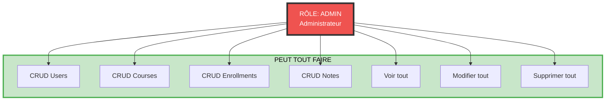
```mermaid
graph TB
    Admin["RÔLE: ADMIN<br/>Administrateur"]
    
    subgraph Autorise["PEUT TOUT FAIRE"]
        direction TB
        A1["CRUD Users"]
        A2["CRUD Courses"]
        A3["CRUD Enrollments"]
        A4["CRUD Notes"]
        A5["Voir tout"]
        A6["Modifier tout"]
        A7["Supprimer tout"]
    end
    
    Admin --> A1
    Admin --> A2
    Admin --> A3
    Admin --> A4
    Admin --> A5
    Admin --> A6
    Admin --> A7
    
    style Admin fill:#EF5350,color:#fff,stroke:#333,stroke-width:4px
    style Autorise fill:#C8E6C9,color:#000,stroke:#4CAF50,stroke-width:3px
```

---

### Checklist ADMIN – Résumé par Points

#### Authentification
- Inscription (POST /v1/auth/signup)
- Connexion (POST /v1/auth/signin-info)
- Vérifier profil (GET /v1/profile)

#### Tests sur Users
- Créer un utilisateur (POST /v1/users)
- Lire tous les utilisateurs (GET /v1/users)
- Filtrer par rôle (GET /v1/users?role=professor)
- Lire un utilisateur spécifique (GET /v1/users/{uid})
- Modifier un utilisateur (PUT /v1/users/{uid})
- Supprimer un utilisateur (DELETE /v1/users/{uid})

#### Tests sur Courses
- Créer un cours (POST /v1/courses)
- Créer plusieurs cours (POST /v1/courses)
- Lire tous les cours (GET /v1/courses)
- Lire un cours spécifique (GET /v1/courses/{id})
- Modifier un cours (PUT /v1/courses/{id})
- Supprimer un cours (DELETE /v1/courses/{id})
- Lire ses cours (GET /v1/courses/my)

#### Tests sur Notes
- Créer une note (POST /v1/notes)
- Créer plusieurs notes (POST /v1/notes)
- Lire toutes ses notes (GET /v1/notes)
- Lire une note spécifique (GET /v1/notes/{id})
- Modifier une note (PUT /v1/notes/{id})
- Supprimer une note (DELETE /v1/notes/{id})

#### Tests de Validation
- Créer cours avec titre trop court (POST /v1/courses) → 422
- Créer cours avec maxStudents invalide → 422
- Créer utilisateur avec email invalide → 422
- Créer utilisateur avec rôle invalide → 422

---

### Tests ADMIN – Format JSON

```json
{
  "role": "ADMIN",
  "tests": {
    "auth": [
      "POST /v1/auth/signup (inscription)",
      "POST /v1/auth/signin-info (connexion)",
      "GET /v1/profile (profil)"
    ],
    "users": [
      "POST /v1/users (créer)",
      "GET /v1/users (lire tous)",
      "GET /v1/users?role=professor (filtrer)",
      "GET /v1/users/{uid} (récupérer spécifique)",
      "PUT /v1/users/{uid} (modifier)",
      "DELETE /v1/users/{uid} (supprimer)"
    ],
    "courses": [
      "POST /v1/courses (créer)",
      "GET /v1/courses (lire tous)",
      "GET /v1/courses/{id} (récupérer spécifique)",
      "PUT /v1/courses/{id} (modifier)",
      "DELETE /v1/courses/{id} (supprimer)",
      "GET /v1/courses/my (mes cours)"
    ],
    "notes": [
      "POST /v1/notes (créer)",
      "GET /v1/notes (lire toutes)",
      "GET /v1/notes/{id} (récupérer spécifique)",
      "PUT /v1/notes/{id} (modifier)",
      "DELETE /v1/notes/{id} (supprimer)"
    ],
    "validations": [
      "POST /v1/courses (titre trop court → 422)",
      "POST /v1/courses (maxStudents invalide → 422)",
      "POST /v1/users (email invalide → 422)",
      "POST /v1/users (rôle invalide → 422)"
    ]
  }
}
```

Voir l'annexe pour des tests avec des corps de requête !

---

## Annexe 1 - Corps de Requêtes ADMIN

### AUTH

#### POST /v1/auth/signup (inscription)

```json
{
  "email": "admin@school.com",
  "password": "admin123",
  "role": "admin",
  "firstName": "Sophie",
  "lastName": "Administrateur"
}
```

#### POST /v1/auth/signin-info (connexion)

```json
{
  "email": "admin@school.com",
  "password": "admin123"
}
```

#### GET /v1/profile (profil)

(pas de corps requis)

---

### USERS

#### POST /v1/users (créer)

```json
{
  "email": "nouveau.prof@school.com",
  "password": "newprof123",
  "role": "professor",
  "firstName": "Pierre",
  "lastName": "Nouveau"
}
```

#### GET /v1/users (lire tous)

(pas de corps requis)

#### GET /v1/users?role=professor (filtrer)

(pas de corps requis)

#### GET /v1/users/{uid} (récupérer spécifique)

(pas de corps requis)

#### PUT /v1/users/{uid} (modifier)

```json
{
  "firstName": "Pierre",
  "lastName": "Nouveau-Dupont",
  "role": "professor"
}
```

#### DELETE /v1/users/{uid} (supprimer)

(pas de corps requis)

---

### COURSES

#### POST /v1/courses (créer)

```json
{
  "title": "Introduction à Python",
  "description": "Apprendre les bases de Python",
  "maxStudents": 30
}
```

#### GET /v1/courses (lire tous)

(pas de corps requis)

#### GET /v1/courses/{id} (récupérer spécifique)

(pas de corps requis)

#### PUT /v1/courses/{id} (modifier)

```json
{
  "title": "Introduction à Python - Niveau Avancé",
  "description": "Apprendre Python en profondeur",
  "maxStudents": 25
}
```

#### DELETE /v1/courses/{id} (supprimer)

(pas de corps requis)

#### GET /v1/courses/my (mes cours)

(pas de corps requis)

---

### NOTES

#### POST /v1/notes (créer)

```json
{
  "title": "Résumé Python",
  "content": "Variables, fonctions, boucles, conditions..."
}
```

#### GET /v1/notes (lire toutes)

(pas de corps requis)

#### GET /v1/notes/{id} (récupérer spécifique)

(pas de corps requis)

#### PUT /v1/notes/{id} (modifier)

```json
{
  "title": "Résumé Python - Complet",
  "content": "Variables, fonctions, boucles, conditions, classes..."
}
```

#### DELETE /v1/notes/{id} (supprimer)

(pas de corps requis)

---

### Tests de Validation

#### POST /v1/courses (titre trop court → 422)

```json
{
  "title": "Py",
  "description": "Description valide",
  "maxStudents": 30
}
```

#### POST /v1/courses (maxStudents invalide → 422)

```json
{
  "title": "Cours valide",
  "description": "Description valide",
  "maxStudents": 0
}
```

#### POST /v1/users (email invalide → 422)

```json
{
  "email": "email-invalide",
  "password": "test123",
  "role": "student",
  "firstName": "Test",
  "lastName": "User"
}
```

#### POST /v1/users (rôle invalide → 422)

```json
{
  "email": "test@school.com",
  "password": "test123",
  "role": "super-admin",
  "firstName": "Test",
  "lastName": "User"
}
```

---

## 4 - Testez les endpoints du rôle PROFESSOR

### Utilisateur 2 – prof.martin@school.com (PROFESSOR)

#### 4.1 – Login

POST /v1/auth/signin-info

```json
{
  "email": "prof.martin@school.com",
  "password": "prof123"
}
```

#### 4.2 – Ajout du token à Swagger

Ou simplement allez en haut à droite dans Swagger et collez le TOKEN_OBTENU (MÉTHODE PRÉFÉRÉE)

#### 4.3 – Profil courant

GET /v1/profile

(pas de corps requis)

---

### Permissions PROFESSOR

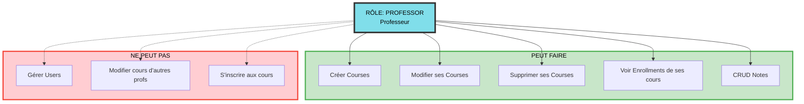
```mermaid
graph TB
    Professor["RÔLE: PROFESSOR<br/>Professeur"]
    
    subgraph Autorise["PEUT FAIRE"]
        direction TB
        P1["Créer Courses"]
        P2["Modifier ses Courses"]
        P3["Supprimer ses Courses"]
        P4["Voir Enrollments de ses cours"]
        P5["CRUD Notes"]
    end
    
    subgraph Interdit["NE PEUT PAS"]
        direction TB
        P6["Gérer Users"]
        P7["Modifier cours d'autres profs"]
        P8["S'inscrire aux cours"]
    end
    
    Professor --> P1
    Professor --> P2
    Professor --> P3
    Professor --> P4
    Professor --> P5
    
    Professor -.-> P6
    Professor -.-> P7
    Professor -.-> P8
    
    style Professor fill:#80DEEA,color:#000,stroke:#333,stroke-width:4px
    style Autorise fill:#C8E6C9,color:#000,stroke:#4CAF50,stroke-width:3px
    style Interdit fill:#FFCDD2,color:#000,stroke:#F44336,stroke-width:3px
```

---

### Checklist PROFESSOR – Résumé par points

#### Authentification
- Connexion (POST /v1/auth/signin-info)
- Vérifier profil (GET /v1/profile)

#### Courses (PROFESSOR peut créer/lire/modifier/supprimer ses cours)
- Lire tous les cours (GET /v1/courses)
- Créer un cours (POST /v1/courses)
- Créer plusieurs cours (POST /v1/courses)
- Lire un cours spécifique (GET /v1/courses/{id})
- Modifier un cours (PUT /v1/courses/{id}) - Seulement ses cours
- Supprimer un cours (DELETE /v1/courses/{id}) - Seulement ses cours
- Lire ses cours (GET /v1/courses/my)
- Voir les inscriptions (GET /v1/courses/{courseId}/enrollments)

#### Notes (PROFESSOR a CRUD complet)
- Créer une note (POST /v1/notes)
- Lire toutes ses notes (GET /v1/notes)
- Lire une note spécifique (GET /v1/notes/{id})
- Modifier une note (PUT /v1/notes/{id})
- Supprimer une note (DELETE /v1/notes/{id})

#### Tests négatifs
- Créer un utilisateur (POST /v1/users) → 403 attendu
- S'inscrire à un cours (POST /v1/enrollments) → 403 attendu

---

### Matrice PROFESSOR (rappel)

| Ressource | GET (list/one) | POST | PUT | DELETE |
|-----------|----------------|------|-----|--------|
| Users | NON (403) | NON (403) | NON (403) | NON (403) |
| Courses | OUI | OUI | OUI (ses cours) | OUI (ses cours) |
| Enrollments | OUI (ses cours) | NON (403) | NON | NON (403) |
| Notes | OUI | OUI | OUI | OUI |

---

## Annexe 2 - Corps de Requêtes PROFESSOR

### COURSES

#### POST /v1/courses (créer 1)

```json
{
  "title": "JavaScript Moderne",
  "description": "Apprendre ES6+ et les frameworks modernes",
  "maxStudents": 25
}
```

#### POST /v1/courses (créer 2)

```json
{
  "title": "React pour débutants",
  "description": "Construire des applications web avec React",
  "maxStudents": 20
}
```

#### PUT /v1/courses/{id} (modifier)

```json
{
  "title": "JavaScript Moderne - Edition 2024",
  "description": "Maîtriser ES6+, async/await et les design patterns",
  "maxStudents": 30
}
```

#### GET /v1/courses

(pas de corps requis)

#### GET /v1/courses/{id}

(pas de corps requis)

#### GET /v1/courses/my

(pas de corps requis)

#### DELETE /v1/courses/{id}

(pas de corps requis)

#### GET /v1/courses/{courseId}/enrollments

(pas de corps requis)

---

### NOTES

#### POST /v1/notes (créer 1)

```json
{
  "title": "Plan de cours JavaScript",
  "content": "Semaine 1: Variables, Semaine 2: Fonctions, Semaine 3: Objets..."
}
```

#### POST /v1/notes (créer 2)

```json
{
  "title": "Ressources pédagogiques",
  "content": "MDN, JavaScript.info, FreeCodeCamp..."
}
```

#### PUT /v1/notes/{id} (modifier)

```json
{
  "title": "Plan de cours JavaScript - Version 2",
  "content": "Semaine 1: Variables, Semaine 2: Fonctions et closures..."
}
```

#### GET /v1/notes

(pas de corps requis)

#### GET /v1/notes/{id}

(pas de corps requis)

#### DELETE /v1/notes/{id}

(pas de corps requis)

---

### Cas négatifs conseillés (rapides)

#### POST /v1/users (PROFESSOR → 403)

```json
{
  "email": "test@school.com",
  "password": "test123",
  "role": "student",
  "firstName": "Test",
  "lastName": "User"
}
```

#### POST /v1/enrollments (PROFESSOR → 403)

```json
{
  "courseId": "n-importe-quel-id"
}
```

#### POST /v1/courses (titre trop court → 422)

```json
{
  "title": "JS",
  "description": "Description valide",
  "maxStudents": 30
}
```

---

### Astuces pratiques

- Utilise d'abord GET /v1/courses pour récupérer les IDs de cours
- Garde à portée les IDs créés (Courses & Notes) pour enchaîner PUT/DELETE/GET
- Si un appel échoue :
  - Vérifier le token (cadenas Swagger)
  - Vérifier le rôle (GET /v1/profile)
  - Vérifier l'ID
  - Valider le JSON

---

## 5 - Testez les endpoints du rôle STUDENT

### Utilisateur 3 – student.dupont@school.com (STUDENT)

#### 5.1 – Login

POST /v1/auth/signin-info

```json
{
  "email": "student.dupont@school.com",
  "password": "student123"
}
```

#### 5.2 – Ajout du token à Swagger

Ou simplement allez en haut à droite dans Swagger et collez le TOKEN_OBTENU (MÉTHODE PRÉFÉRÉE)

#### 5.3 – Profil courant

GET /v1/profile

(pas de corps requis)

---

### Permissions STUDENT

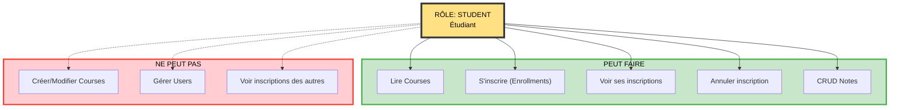
```mermaid
graph TB
    Student["RÔLE: STUDENT<br/>Étudiant"]
    
    subgraph Autorise["PEUT FAIRE"]
        direction TB
        S1["Lire Courses"]
        S2["S'inscrire (Enrollments)"]
        S3["Voir ses inscriptions"]
        S4["Annuler inscription"]
        S5["CRUD Notes"]
    end
    
    subgraph Interdit["NE PEUT PAS"]
        direction TB
        S6["Créer/Modifier Courses"]
        S7["Gérer Users"]
        S8["Voir inscriptions des autres"]
    end
    
    Student --> S1
    Student --> S2
    Student --> S3
    Student --> S4
    Student --> S5
    
    Student -.-> S6
    Student -.-> S7
    Student -.-> S8
    
    style Student fill:#FFE082,color:#000,stroke:#333,stroke-width:4px
    style Autorise fill:#C8E6C9,color:#000,stroke:#4CAF50,stroke-width:3px
    style Interdit fill:#FFCDD2,color:#000,stroke:#F44336,stroke-width:3px
```

---

### Checklist STUDENT – Résumé par points

#### Authentification
- Connexion (POST /v1/auth/signin-info)
- Voir profil (GET /v1/profile)

#### Courses (STUDENT = lecture seule)
- Lire tous les cours (GET /v1/courses)
- Lire un cours spécifique (GET /v1/courses/{id})
- Créer un cours (POST /v1/courses) → 403 attendu
- Modifier un cours (PUT /v1/courses/{id}) → 403 attendu
- Supprimer un cours (DELETE /v1/courses/{id}) → 403 attendu

#### Enrollments (STUDENT = s'inscrire, voir, annuler)
- S'inscrire à un cours (POST /v1/enrollments)
- Voir ses inscriptions (GET /v1/enrollments/my)
- Annuler une inscription (DELETE /v1/enrollments/{id})

#### Notes (STUDENT = CRUD complet)
- Créer une note (POST /v1/notes)
- Lire toutes ses notes (GET /v1/notes)
- Lire une note spécifique (GET /v1/notes/{id})
- Modifier une note (PUT /v1/notes/{id})
- Supprimer une note (DELETE /v1/notes/{id})

#### Tests négatifs
- Créer utilisateur (POST /v1/users) → 403
- Créer cours (POST /v1/courses) → 403
- Voir inscriptions d'un cours (GET /v1/courses/{id}/enrollments) → 403

---

### Matrice STUDENT (rappel)

| Ressource | GET (list/one) | POST | PUT | DELETE |
|-----------|----------------|------|-----|--------|
| Users | NON (403) | NON (403) | NON (403) | NON (403) |
| Courses | OUI | NON (403) | NON (403) | NON (403) |
| Enrollments | OUI (ses inscriptions) | OUI | NON | OUI |
| Notes | OUI | OUI | OUI | OUI |

---

## Annexe 3 - Corps de Requêtes STUDENT

### AUTH

#### POST /v1/auth/signin-info (connexion)

```json
{
  "email": "student.dupont@school.com",
  "password": "student123"
}
```

#### GET /v1/profile (profil)

(pas de corps requis)

---

### COURSES (lecture seule)

#### GET /v1/courses

(pas de corps requis)

#### GET /v1/courses/{id}

(pas de corps requis)

#### POST /v1/courses (doit échouer → 403)

```json
{
  "title": "Tentative non autorisée par STUDENT",
  "description": "Devrait échouer",
  "maxStudents": 30
}
```

#### PUT /v1/courses/{id} (doit échouer → 403)

```json
{
  "title": "Modification non autorisée",
  "description": "Devrait échouer",
  "maxStudents": 30
}
```

#### DELETE /v1/courses/{id} (doit échouer → 403)

(pas de corps requis)

---

### ENROLLMENTS

Remplace courseId par un ID réel de cours (créé par Admin/Professor).

#### POST /v1/enrollments (s'inscrire)

```json
{
  "courseId": "REMPLACER-AVEC-ID-COURS-VALIDE"
}
```

#### GET /v1/enrollments/my (mes inscriptions)

(pas de corps requis)

#### DELETE /v1/enrollments/{id} (annuler)

(pas de corps requis)

---

### NOTES

#### POST /v1/notes (créer)

```json
{
  "title": "Notes de cours Python",
  "content": "Variables: let, const. Fonctions: arrow functions..."
}
```

#### PUT /v1/notes/{id} (modifier)

```json
{
  "title": "Notes de cours Python - Complètes",
  "content": "Variables: let, const. Fonctions: arrow functions. Async: Promises..."
}
```

#### GET /v1/notes

(pas de corps requis)

#### GET /v1/notes/{id}

(pas de corps requis)

#### DELETE /v1/notes/{id}

(pas de corps requis)

---

### Cas négatifs conseillés (rapides)

#### GET /v1/profile (sans token → 401)

(pas de corps requis)

#### POST /v1/enrollments (cours complet → 400)

```json
{
  "courseId": "ID-COURS-COMPLET"
}
```

#### POST /v1/enrollments (déjà inscrit → 400)

```json
{
  "courseId": "ID-COURS-DÉJÀ-INSCRIT"
}
```

#### POST /v1/enrollments (courseId inexistant → 404)

```json
{
  "courseId": "id-inexistant-12345"
}
```

#### POST /v1/notes (titre manquant → 422)

```json
{
  "content": "Contenu sans titre"
}
```

#### GET /v1/courses/{courseId}/enrollments (STUDENT → 403)

(pas de corps requis)

---

### Astuces pratiques

- Commence par GET /v1/courses pour récupérer les IDs de cours disponibles
- Garde les IDs de tes inscriptions et notes sous la main pour tester PUT/DELETE/GET
- Si un appel échoue : vérifie token (cadenas) → rôle → ID → JSON

---

## Architecture Firebase Functions

### Flux Complet d'une Requête

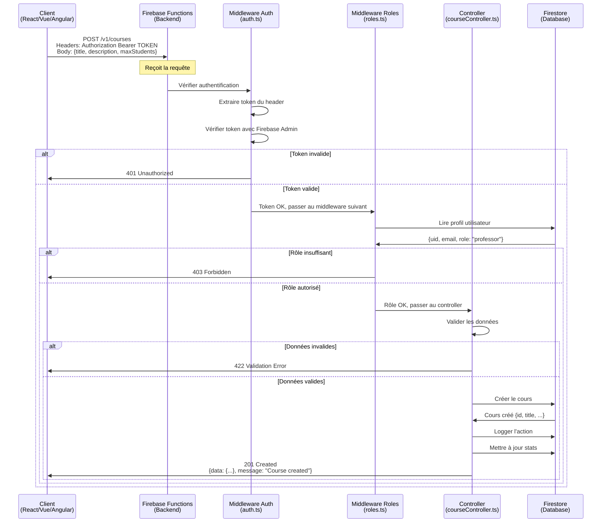
```mermaid
sequenceDiagram
    participant C as Client<br/>(React/Vue/Angular)
    participant F as Firebase Functions<br/>(Backend)
    participant A as Middleware Auth<br/>(auth.ts)
    participant R as Middleware Roles<br/>(roles.ts)
    participant Ctrl as Controller<br/>(courseController.ts)
    participant DB as Firestore<br/>(Database)
    
    C->>F: POST /v1/courses<br/>Headers: Authorization Bearer TOKEN<br/>Body: {title, description, maxStudents}
    
    Note over F: Reçoit la requête
    
    F->>A: Vérifier authentification
    A->>A: Extraire token du header
    A->>A: Vérifier token avec Firebase Admin
    
    alt Token invalide
        A->>C: 401 Unauthorized
    else Token valide
        A->>R: Token OK, passer au middleware suivant
        
        R->>DB: Lire profil utilisateur
        DB->>R: {uid, email, role: "professor"}
        
        alt Rôle insuffisant
            R->>C: 403 Forbidden
        else Rôle autorisé
            R->>Ctrl: Rôle OK, passer au controller
            
            Ctrl->>Ctrl: Valider les données
            
            alt Données invalides
                Ctrl->>C: 422 Validation Error
            else Données valides
                Ctrl->>DB: Créer le cours
                DB->>Ctrl: Cours créé {id, title, ...}
                
                Ctrl->>DB: Logger l'action
                Ctrl->>DB: Mettre à jour stats
                
                Ctrl->>C: 201 Created<br/>{data: {...}, message: "Course created"}
            end
        end
    end
```

### Architecture des Fichiers

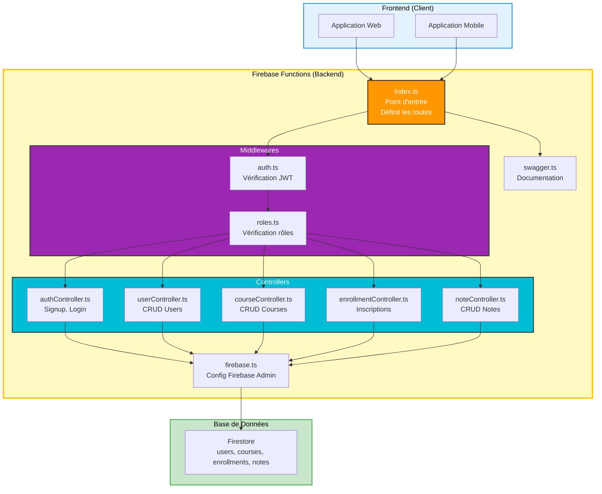
```mermaid
graph TB
    subgraph Client["Frontend (Client)"]
        Web["Application Web"]
        Mobile["Application Mobile"]
    end
    
    subgraph Functions["Firebase Functions (Backend)"]
        direction TB
        
        Index["index.ts<br/>Point d'entrée<br/>Définit les routes"]
        
        subgraph Middlewares["Middlewares"]
            Auth["auth.ts<br/>Vérification JWT"]
            Roles["roles.ts<br/>Vérification rôles"]
        end
        
        subgraph Controllers["Controllers"]
            AuthCtrl["authController.ts<br/>Signup, Login"]
            UserCtrl["userController.ts<br/>CRUD Users"]
            CourseCtrl["courseController.ts<br/>CRUD Courses"]
            EnrollCtrl["enrollmentController.ts<br/>Inscriptions"]
            NoteCtrl["noteController.ts<br/>CRUD Notes"]
        end
        
        Firebase["firebase.ts<br/>Config Firebase Admin"]
        Swagger["swagger.ts<br/>Documentation"]
    end
    
    subgraph Database["Base de Données"]
        Firestore["Firestore<br/>users, courses, enrollments, notes"]
    end
    
    Web --> Index
    Mobile --> Index
    
    Index --> Auth
    Index --> Swagger
    Auth --> Roles
    Roles --> AuthCtrl
    Roles --> UserCtrl
    Roles --> CourseCtrl
    Roles --> EnrollCtrl
    Roles --> NoteCtrl
    
    AuthCtrl --> Firebase
    UserCtrl --> Firebase
    CourseCtrl --> Firebase
    EnrollCtrl --> Firebase
    NoteCtrl --> Firebase
    
    Firebase --> Firestore
    
    style Client fill:#E3F2FD,color:#000,stroke:#2196F3,stroke-width:2px
    style Functions fill:#FFF9C4,color:#000,stroke:#FFC107,stroke-width:3px
    style Database fill:#C8E6C9,color:#000,stroke:#4CAF50,stroke-width:2px
    style Index fill:#FF9800,color:#fff,stroke:#333,stroke-width:2px
    style Middlewares fill:#9C27B0,color:#fff,stroke:#333,stroke-width:2px
    style Controllers fill:#00BCD4,color:#fff,stroke:#333,stroke-width:2px
```

---

## Matrice Complète des Permissions


```mermaid
graph TB
    subgraph Legend["Légende"]
        OK["OUI"]
        NOK["NON"]
    end
    
    subgraph Users["Users"]
        UGet["GET /users"]
        UPost["POST /users"]
        UPut["PUT /users/:uid"]
        UDel["DELETE /users/:uid"]
    end
    
    subgraph Courses["Courses"]
        CGet["GET /courses"]
        CPost["POST /courses"]
        CPut["PUT /courses/:id"]
        CDel["DELETE /courses/:id"]
    end
    
    subgraph Enrollments["Enrollments"]
        EPost["POST /enrollments"]
        EGet["GET /enrollments/my"]
        EDel["DELETE /enrollments/:id"]
    end
    
    subgraph Notes["Notes"]
        NGet["GET /notes"]
        NPost["POST /notes"]
        NPut["PUT /notes/:id"]
        NDel["DELETE /notes/:id"]
    end
    
    StudentRole["STUDENT"] -.->|NON| UGet
    StudentRole -.->|OUI| CGet
    StudentRole -.->|NON| CPost
    StudentRole -.->|OUI| EPost
    StudentRole -.->|OUI| EGet
    StudentRole -.->|OUI| NGet
    StudentRole -.->|OUI| NPost
    
    ProfRole["PROFESSOR"] -.->|NON| UGet
    ProfRole -.->|OUI| CGet
    ProfRole -.->|OUI| CPost
    ProfRole -.->|OUI| CPut
    ProfRole -.->|OUI| CDel
    ProfRole -.->|NON| EPost
    ProfRole -.->|OUI| NGet
    ProfRole -.->|OUI| NPost
    
    AdminRole["ADMIN"] -.->|OUI| UGet
    AdminRole -.->|OUI| UPost
    AdminRole -.->|OUI| UPut
    AdminRole -.->|OUI| UDel
    AdminRole -.->|OUI| CGet
    AdminRole -.->|OUI| CPost
    AdminRole -.->|OUI| CPut
    AdminRole -.->|OUI| CDel
    AdminRole -.->|OUI| EPost
    AdminRole -.->|OUI| EGet
    AdminRole -.->|OUI| EDel
    AdminRole -.->|OUI| NGet
    AdminRole -.->|OUI| NPost
    AdminRole -.->|OUI| NPut
    AdminRole -.->|OUI| NDel
    
    style StudentRole fill:#FFE082,color:#000,stroke:#333,stroke-width:2px
    style ProfRole fill:#80DEEA,color:#000,stroke:#333,stroke-width:2px
    style AdminRole fill:#EF5350,color:#fff,stroke:#333,stroke-width:2px
    style OK fill:#C8E6C9,color:#000
    style NOK fill:#FFCDD2,color:#000
    style Users fill:#E3F2FD,color:#000,stroke:#2196F3,stroke-width:2px
    style Courses fill:#FFF9C4,color:#000,stroke:#FFC107,stroke-width:2px
    style Enrollments fill:#F3E5F5,color:#000,stroke:#9C27B0,stroke-width:2px
    style Notes fill:#E8F5E9,color:#000,stroke:#4CAF50,stroke-width:2px
```

---

## Endpoints de l'API

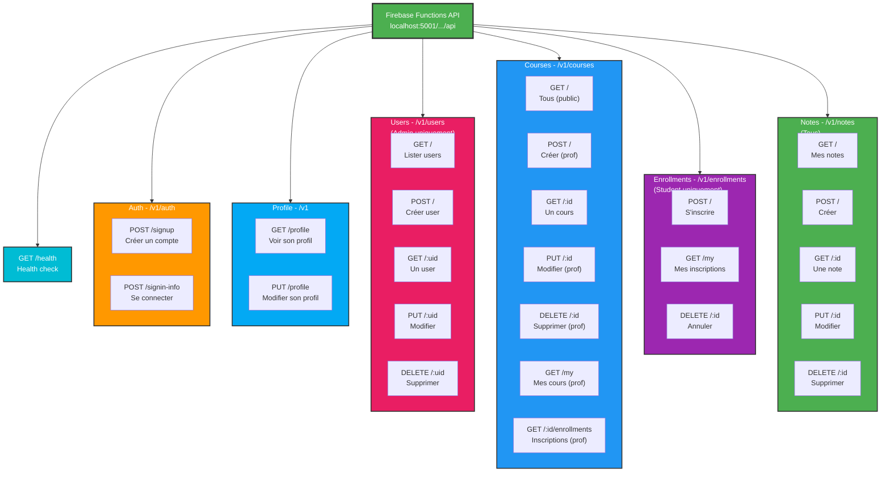
```mermaid
graph TB
    API["Firebase Functions API<br/>localhost:5001/.../api"]
    
    subgraph Auth["Auth - /v1/auth"]
        AuthSignup["POST /signup<br/>Créer un compte"]
        AuthSignin["POST /signin-info<br/>Se connecter"]
    end
    
    subgraph Profile["Profile - /v1"]
        ProfileGet["GET /profile<br/>Voir son profil"]
        ProfilePut["PUT /profile<br/>Modifier son profil"]
    end
    
    subgraph Users["Users - /v1/users<br/>(Admin uniquement)"]
        UsersGet["GET /<br/>Lister users"]
        UsersPost["POST /<br/>Créer user"]
        UsersGetOne["GET /:uid<br/>Un user"]
        UsersPut["PUT /:uid<br/>Modifier"]
        UsersDel["DELETE /:uid<br/>Supprimer"]
    end
    
    subgraph Courses["Courses - /v1/courses"]
        CoursesGet["GET /<br/>Tous (public)"]
        CoursesPost["POST /<br/>Créer (prof)"]
        CoursesGetOne["GET /:id<br/>Un cours"]
        CoursesPut["PUT /:id<br/>Modifier (prof)"]
        CoursesDel["DELETE /:id<br/>Supprimer (prof)"]
        CoursesMy["GET /my<br/>Mes cours (prof)"]
        CoursesEnroll["GET /:id/enrollments<br/>Inscriptions (prof)"]
    end
    
    subgraph Enrollments["Enrollments - /v1/enrollments<br/>(Student uniquement)"]
        EnrollPost["POST /<br/>S'inscrire"]
        EnrollMy["GET /my<br/>Mes inscriptions"]
        EnrollDel["DELETE /:id<br/>Annuler"]
    end
    
    subgraph Notes["Notes - /v1/notes<br/>(Tous)"]
        NotesGet["GET /<br/>Mes notes"]
        NotesPost["POST /<br/>Créer"]
        NotesGetOne["GET /:id<br/>Une note"]
        NotesPut["PUT /:id<br/>Modifier"]
        NotesDel["DELETE /:id<br/>Supprimer"]
    end
    
    Health["GET /health<br/>Health check"]
    
    API --> Auth
    API --> Profile
    API --> Users
    API --> Courses
    API --> Enrollments
    API --> Notes
    API --> Health
    
    style API fill:#4CAF50,color:#fff,stroke:#333,stroke-width:3px
    style Auth fill:#FF9800,color:#fff,stroke:#333,stroke-width:2px
    style Profile fill:#03A9F4,color:#fff,stroke:#333,stroke-width:2px
    style Users fill:#E91E63,color:#fff,stroke:#333,stroke-width:2px
    style Courses fill:#2196F3,color:#fff,stroke:#333,stroke-width:2px
    style Enrollments fill:#9C27B0,color:#fff,stroke:#333,stroke-width:2px
    style Notes fill:#4CAF50,color:#fff,stroke:#333,stroke-width:2px
    style Health fill:#00BCD4,color:#fff,stroke:#333,stroke-width:2px
```

TOTAL : 26 endpoints

---

## Workflow de Tests

### Ordre de Test Recommandé


```mermaid
graph TB
    Start["Démarrer"]
    Emu["Démarrer émulateurs<br/>npm run serve"]
    CreateUsers["Créer 3 utilisateurs<br/>POST /v1/auth/signup"]
    
    TestAdmin["Tests ADMIN"]
    TestProf["Tests PROFESSOR"]
    TestStudent["Tests STUDENT"]
    
    AdminLogin["Login ADMIN"]
    AdminTests["24 tests ADMIN"]
    AdminLogout["Logout"]
    
    ProfLogin["Login PROFESSOR"]
    ProfTests["14 tests PROFESSOR"]
    ProfLogout["Logout"]
    
    StudLogin["Login STUDENT"]
    StudTests["17 tests STUDENT"]
    StudLogout["Logout"]
    
    End["Tests terminés<br/>55 tests total"]
    
    Start --> Emu
    Emu --> CreateUsers
    CreateUsers --> TestAdmin
    
    TestAdmin --> AdminLogin
    AdminLogin --> AdminTests
    AdminTests --> AdminLogout
    
    AdminLogout --> TestProf
    TestProf --> ProfLogin
    ProfLogin --> ProfTests
    ProfTests --> ProfLogout
    
    ProfLogout --> TestStudent
    TestStudent --> StudLogin
    StudLogin --> StudTests
    StudTests --> StudLogout
    
    StudLogout --> End
    
    style Start fill:#4CAF50,color:#fff,stroke:#333,stroke-width:3px
    style End fill:#4CAF50,color:#fff,stroke:#333,stroke-width:3px
    style Emu fill:#FF9800,color:#fff,stroke:#333,stroke-width:2px
    style CreateUsers fill:#2196F3,color:#fff,stroke:#333,stroke-width:2px
    style AdminLogin fill:#EF5350,color:#fff,stroke:#333,stroke-width:2px
    style ProfLogin fill:#80DEEA,color:#000,stroke:#333,stroke-width:2px
    style StudLogin fill:#FFE082,color:#000,stroke:#333,stroke-width:2px
```

---

## Récapitulatif Final

### Matrice Complète des Permissions (Tableau)

| Endpoint | ADMIN | PROFESSOR | STUDENT |
|----------|-------|-----------|---------|
| **Users** | | | |
| GET /v1/users | OUI | NON (403) | NON (403) |
| POST /v1/users | OUI | NON (403) | NON (403) |
| PUT /v1/users/{uid} | OUI | NON (403) | NON (403) |
| DELETE /v1/users/{uid} | OUI | NON (403) | NON (403) |
| **Courses** | | | |
| GET /v1/courses | OUI | OUI | OUI |
| POST /v1/courses | OUI | OUI | NON (403) |
| GET /v1/courses/{id} | OUI | OUI | OUI |
| PUT /v1/courses/{id} | OUI | OUI (ses cours) | NON (403) |
| DELETE /v1/courses/{id} | OUI | OUI (ses cours) | NON (403) |
| GET /v1/courses/my | OUI | OUI | NON (403) |
| GET /v1/courses/{id}/enrollments | OUI | OUI (ses cours) | NON (403) |
| **Enrollments** | | | |
| POST /v1/enrollments | OUI | NON (403) | OUI |
| GET /v1/enrollments/my | OUI | NON (403) | OUI |
| DELETE /v1/enrollments/{id} | OUI | NON (403) | OUI |
| **Notes** | | | |
| GET /v1/notes | OUI | OUI | OUI |
| POST /v1/notes | OUI | OUI | OUI |
| GET /v1/notes/{id} | OUI | OUI | OUI |
| PUT /v1/notes/{id} | OUI | OUI | OUI |
| DELETE /v1/notes/{id} | OUI | OUI | OUI |

---

## Codes HTTP à Connaître

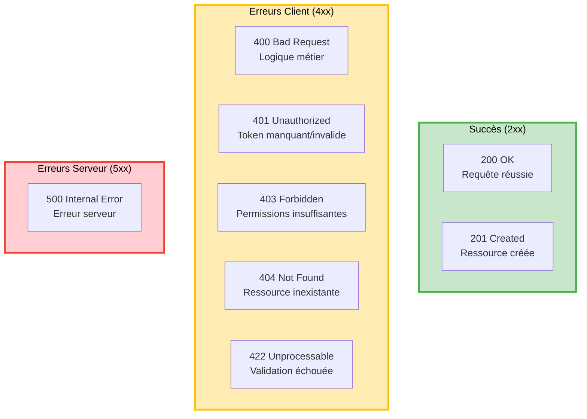
```mermaid
graph TB
    subgraph Success["Succès (2xx)"]
        S1["200 OK<br/>Requête réussie"]
        S2["201 Created<br/>Ressource créée"]
    end
    
    subgraph ClientError["Erreurs Client (4xx)"]
        E1["400 Bad Request<br/>Logique métier"]
        E2["401 Unauthorized<br/>Token manquant/invalide"]
        E3["403 Forbidden<br/>Permissions insuffisantes"]
        E4["404 Not Found<br/>Ressource inexistante"]
        E5["422 Unprocessable<br/>Validation échouée"]
    end
    
    subgraph ServerError["Erreurs Serveur (5xx)"]
        E6["500 Internal Error<br/>Erreur serveur"]
    end
    
    style Success fill:#C8E6C9,color:#000,stroke:#4CAF50,stroke-width:3px
    style ClientError fill:#FFECB3,color:#000,stroke:#FFC107,stroke-width:3px
    style ServerError fill:#FFCDD2,color:#000,stroke:#F44336,stroke-width:3px
```

| Code | Signification | Exemple |
|------|---------------|---------|
| 200 | OK | GET, PUT, DELETE réussis |
| 201 | Created | POST réussi (ressource créée) |
| 400 | Bad Request | Logique métier (cours complet, déjà inscrit) |
| 401 | Unauthorized | Token manquant ou invalide |
| 403 | Forbidden | Token valide mais permissions insuffisantes |
| 404 | Not Found | Ressource inexistante |
| 422 | Unprocessable Entity | Validation échouée (données invalides) |
| 500 | Internal Server Error | Erreur serveur |

---

## Exemple Concret : S'inscrire à un Cours

### Flux d'Inscription avec Transaction Atomique

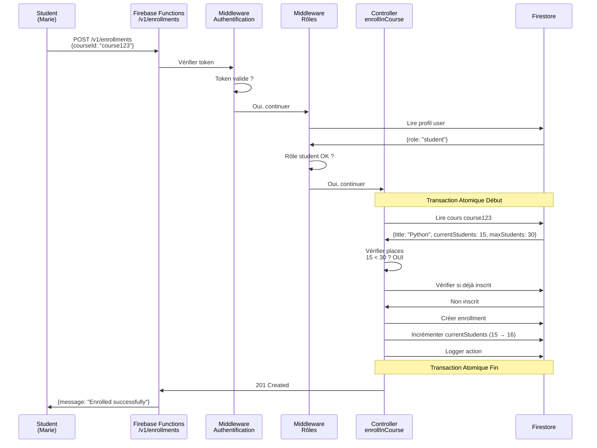
```mermaid
sequenceDiagram
    participant S as Student<br/>(Marie)
    participant API as Firebase Functions<br/>/v1/enrollments
    participant Auth as Middleware<br/>Authentification
    participant Role as Middleware<br/>Rôles
    participant Ctrl as Controller<br/>enrollInCourse
    participant DB as Firestore
    
    S->>API: POST /v1/enrollments<br/>{courseId: "course123"}
    
    API->>Auth: Vérifier token
    Auth->>Auth: Token valide ?
    Auth->>Role: Oui, continuer
    
    Role->>DB: Lire profil user
    DB->>Role: {role: "student"}
    Role->>Role: Rôle student OK ?
    Role->>Ctrl: Oui, continuer
    
    Note over Ctrl,DB: Transaction Atomique Début
    
    Ctrl->>DB: Lire cours course123
    DB->>Ctrl: {title: "Python", currentStudents: 15, maxStudents: 30}
    
    Ctrl->>Ctrl: Vérifier places<br/>15 < 30 ? OUI
    
    Ctrl->>DB: Vérifier si déjà inscrit
    DB->>Ctrl: Non inscrit
    
    Ctrl->>DB: Créer enrollment
    Ctrl->>DB: Incrémenter currentStudents (15 → 16)
    Ctrl->>DB: Logger action
    
    Note over Ctrl,DB: Transaction Atomique Fin
    
    Ctrl->>API: 201 Created
    API->>S: {message: "Enrolled successfully"}
```

### Ce qui se passe en coulisses

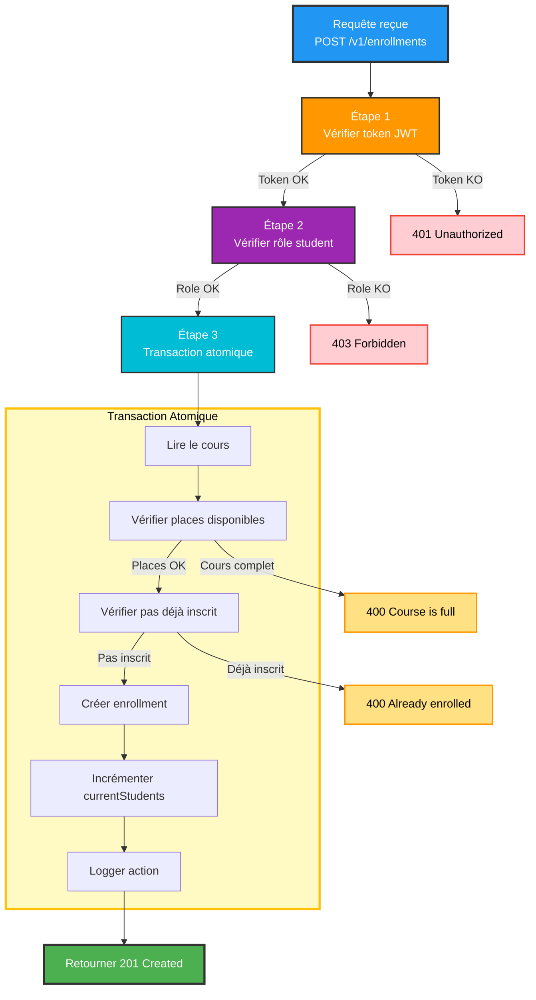
```mermaid
graph TB
    Request["Requête reçue<br/>POST /v1/enrollments"]
    
    Step1["Étape 1<br/>Vérifier token JWT"]
    Step2["Étape 2<br/>Vérifier rôle student"]
    Step3["Étape 3<br/>Transaction atomique"]
    
    subgraph Transaction["Transaction Atomique"]
        T1["Lire le cours"]
        T2["Vérifier places disponibles"]
        T3["Vérifier pas déjà inscrit"]
        T4["Créer enrollment"]
        T5["Incrémenter currentStudents"]
        T6["Logger action"]
    end
    
    Success["Retourner 201 Created"]
    
    Request --> Step1
    Step1 -->|Token OK| Step2
    Step1 -->|Token KO| Error401["401 Unauthorized"]
    
    Step2 -->|Role OK| Step3
    Step2 -->|Role KO| Error403["403 Forbidden"]
    
    Step3 --> T1
    T1 --> T2
    T2 -->|Places OK| T3
    T2 -->|Cours complet| Error400A["400 Course is full"]
    
    T3 -->|Pas inscrit| T4
    T3 -->|Déjà inscrit| Error400B["400 Already enrolled"]
    
    T4 --> T5
    T5 --> T6
    T6 --> Success
    
    style Request fill:#2196F3,color:#fff,stroke:#333,stroke-width:3px
    style Step1 fill:#FF9800,color:#fff,stroke:#333,stroke-width:2px
    style Step2 fill:#9C27B0,color:#fff,stroke:#333,stroke-width:2px
    style Step3 fill:#00BCD4,color:#fff,stroke:#333,stroke-width:2px
    style Transaction fill:#FFF9C4,color:#000,stroke:#FFC107,stroke-width:3px
    style Success fill:#4CAF50,color:#fff,stroke:#333,stroke-width:3px
    style Error401 fill:#FFCDD2,color:#000,stroke:#F44336,stroke-width:2px
    style Error403 fill:#FFCDD2,color:#000,stroke:#F44336,stroke-width:2px
    style Error400A fill:#FFE082,color:#000,stroke:#FF9800,stroke-width:2px
    style Error400B fill:#FFE082,color:#000,stroke:#FF9800,stroke-width:2px
```

---

## Où Sont les Firebase Functions dans le Projet ?

### Structure des Fichiers

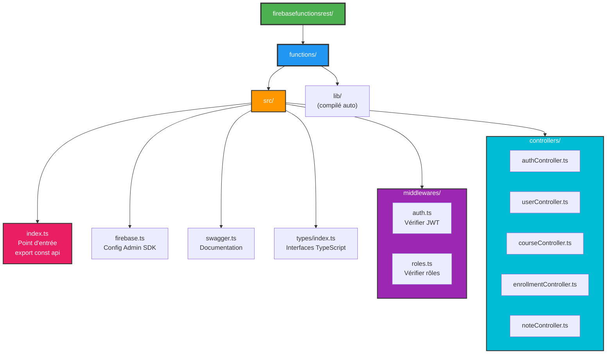
```mermaid
graph TB
    Root["firebasefunctionsrest/"]
    
    Functions["functions/"]
    Src["src/"]
    Lib["lib/<br/>(compilé auto)"]
    
    Index["index.ts<br/>Point d'entrée<br/>export const api"]
    Firebase["firebase.ts<br/>Config Admin SDK"]
    Swagger["swagger.ts<br/>Documentation"]
    
    subgraph Middlewares["middlewares/"]
        Auth["auth.ts<br/>Vérifier JWT"]
        Roles["roles.ts<br/>Vérifier rôles"]
    end
    
    subgraph Controllers["controllers/"]
        AuthCtrl["authController.ts"]
        UserCtrl["userController.ts"]
        CourseCtrl["courseController.ts"]
        EnrollCtrl["enrollmentController.ts"]
        NoteCtrl["noteController.ts"]
    end
    
    Types["types/index.ts<br/>Interfaces TypeScript"]
    
    Root --> Functions
    Functions --> Src
    Functions --> Lib
    
    Src --> Index
    Src --> Firebase
    Src --> Swagger
    Src --> Middlewares
    Src --> Controllers
    Src --> Types
    
    style Root fill:#4CAF50,color:#fff,stroke:#333,stroke-width:3px
    style Functions fill:#2196F3,color:#fff,stroke:#333,stroke-width:3px
    style Src fill:#FF9800,color:#fff,stroke:#333,stroke-width:2px
    style Index fill:#E91E63,color:#fff,stroke:#333,stroke-width:2px
    style Middlewares fill:#9C27B0,color:#fff,stroke:#333,stroke-width:2px
    style Controllers fill:#00BCD4,color:#fff,stroke:#333,stroke-width:2px
```

---

## Comment Fonctionne l'Authentification ?

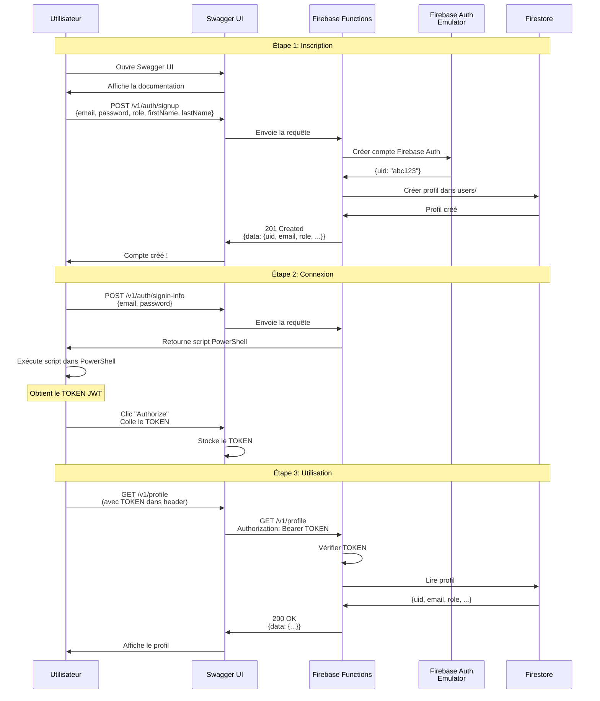
```mermaid
sequenceDiagram
    participant U as Utilisateur
    participant S as Swagger UI
    participant API as Firebase Functions
    participant Auth as Firebase Auth<br/>Emulator
    participant DB as Firestore
    
    Note over U,DB: Étape 1: Inscription
    
    U->>S: Ouvre Swagger UI
    S->>U: Affiche la documentation
    
    U->>S: POST /v1/auth/signup<br/>{email, password, role, firstName, lastName}
    S->>API: Envoie la requête
    
    API->>Auth: Créer compte Firebase Auth
    Auth->>API: {uid: "abc123"}
    
    API->>DB: Créer profil dans users/
    DB->>API: Profil créé
    
    API->>S: 201 Created<br/>{data: {uid, email, role, ...}}
    S->>U: Compte créé !
    
    Note over U,DB: Étape 2: Connexion
    
    U->>S: POST /v1/auth/signin-info<br/>{email, password}
    S->>API: Envoie la requête
    
    API->>U: Retourne script PowerShell
    
    U->>U: Exécute script dans PowerShell
    Note over U: Obtient le TOKEN JWT
    
    U->>S: Clic "Authorize"<br/>Colle le TOKEN
    S->>S: Stocke le TOKEN
    
    Note over U,DB: Étape 3: Utilisation
    
    U->>S: GET /v1/profile<br/>(avec TOKEN dans header)
    S->>API: GET /v1/profile<br/>Authorization: Bearer TOKEN
    
    API->>API: Vérifier TOKEN
    API->>DB: Lire profil
    DB->>API: {uid, email, role, ...}
    
    API->>S: 200 OK<br/>{data: {...}}
    S->>U: Affiche le profil
```

---

## Exemple de Middleware en Action

### Vérification du Token JWT

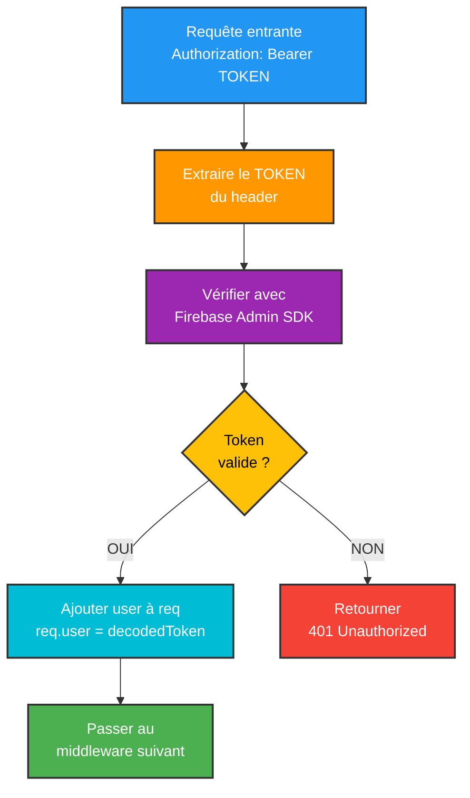
```mermaid
graph TB
    Request["Requête entrante<br/>Authorization: Bearer TOKEN"]
    
    Extract["Extraire le TOKEN<br/>du header"]
    
    Verify["Vérifier avec<br/>Firebase Admin SDK"]
    
    Valid{"Token<br/>valide ?"}
    
    AddUser["Ajouter user à req<br/>req.user = decodedToken"]
    
    Next["Passer au<br/>middleware suivant"]
    
    Error["Retourner<br/>401 Unauthorized"]
    
    Request --> Extract
    Extract --> Verify
    Verify --> Valid
    
    Valid -->|OUI| AddUser
    Valid -->|NON| Error
    
    AddUser --> Next
    
    style Request fill:#2196F3,color:#fff,stroke:#333,stroke-width:2px
    style Extract fill:#FF9800,color:#fff,stroke:#333,stroke-width:2px
    style Verify fill:#9C27B0,color:#fff,stroke:#333,stroke-width:2px
    style Valid fill:#FFC107,color:#000,stroke:#333,stroke-width:2px
    style AddUser fill:#00BCD4,color:#fff,stroke:#333,stroke-width:2px
    style Next fill:#4CAF50,color:#fff,stroke:#333,stroke-width:2px
    style Error fill:#F44336,color:#fff,stroke:#333,stroke-width:2px
```

Fichier: `functions/src/middlewares/auth.ts`

---

### Vérification du Rôle

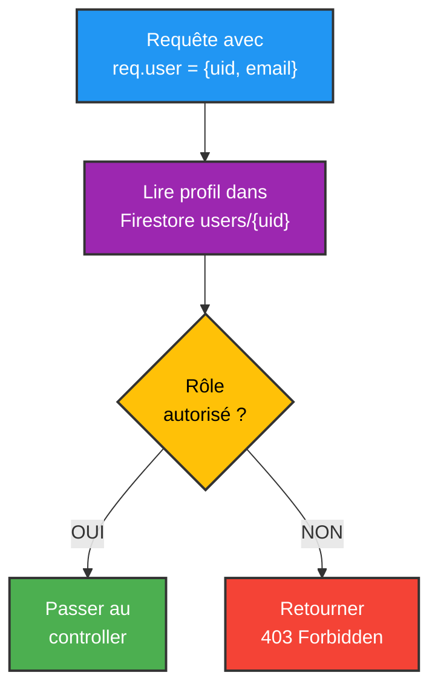
```mermaid
graph TB
    Request["Requête avec<br/>req.user = {uid, email}"]
    
    ReadProfile["Lire profil dans<br/>Firestore users/{uid}"]
    
    CheckRole{"Rôle<br/>autorisé ?"}
    
    Next["Passer au<br/>controller"]
    
    Error["Retourner<br/>403 Forbidden"]
    
    Request --> ReadProfile
    ReadProfile --> CheckRole
    
    CheckRole -->|OUI| Next
    CheckRole -->|NON| Error
    
    style Request fill:#2196F3,color:#fff,stroke:#333,stroke-width:2px
    style ReadProfile fill:#9C27B0,color:#fff,stroke:#333,stroke-width:2px
    style CheckRole fill:#FFC107,color:#000,stroke:#333,stroke-width:2px
    style Next fill:#4CAF50,color:#fff,stroke:#333,stroke-width:2px
    style Error fill:#F44336,color:#fff,stroke:#333,stroke-width:2px
```

Fichier: `functions/src/middlewares/roles.ts`

---

## Récapitulatif des Tests

### Total des Tests par Rôle

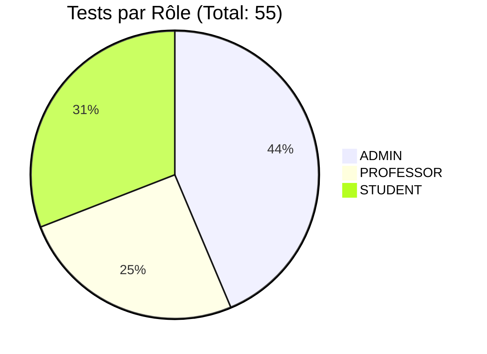
```mermaid
pie title Tests par Rôle (Total: 55)
    "ADMIN" : 24
    "PROFESSOR" : 14
    "STUDENT" : 17
```

### Répartition des Tests ADMIN

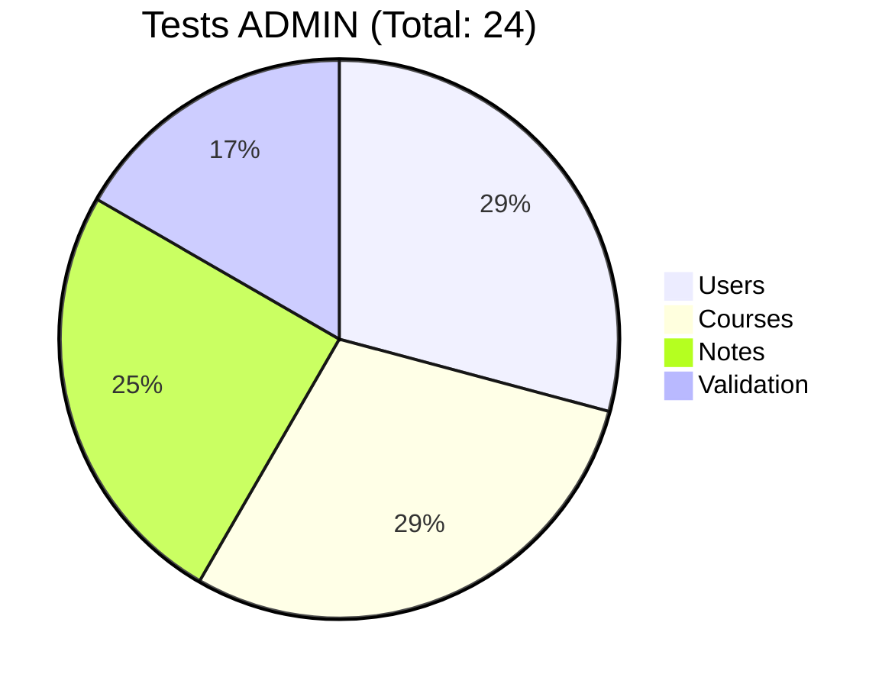
```mermaid
pie title Tests ADMIN (Total: 24)
    "Users" : 7
    "Courses" : 7
    "Notes" : 6
    "Validation" : 4
```

### Répartition des Tests PROFESSOR

```mermaid
pie title Tests PROFESSOR (Total: 14)
    "Courses" : 7
    "Notes" : 4
    "Tests négatifs" : 3
```

### Répartition des Tests STUDENT

```mermaid
pie title Tests STUDENT (Total: 17)
    "Courses (lecture)" : 2
    "Enrollments" : 4
    "Notes" : 6
    "Tests négatifs" : 5
```

---

## Astuces Pratiques

### Garder une Trace des IDs

```
Admin UID: ___________________
Professor UID: ___________________
Student UID: ___________________

Cours 1 ID: ___________________
Cours 2 ID: ___________________
Cours 3 ID: ___________________

Note 1 ID: ___________________
Note 2 ID: ___________________

Enrollment 1 ID: ___________________
Enrollment 2 ID: ___________________
```

### Ordre de Test Recommandé

1. Créer d'abord les ressources (POST)
2. Lire ensuite (GET)
3. Modifier (PUT)
4. Supprimer en dernier (DELETE)

### Vérifier Systématiquement

Après chaque opération :
- Code HTTP correct ?
- Corps de réponse cohérent ?
- Données dans Firestore (Emulator UI) ?

### Se Déconnecter TOUJOURS

Avant de changer d'utilisateur :
1. Authorize (en haut à droite)
2. Logout
3. Close

---

**Date** : 6 octobre 2025  
**Version** : 1.0  
**Projet** : Firebase Functions REST API avec RBAC  
**Format** : Guide complet avec diagrammes Mermaid

