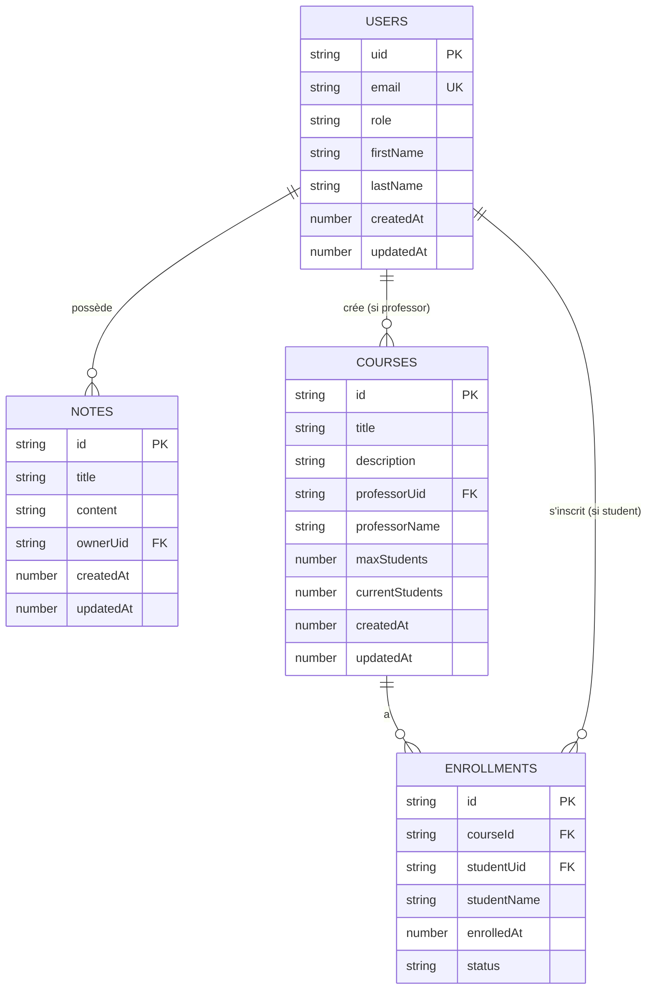
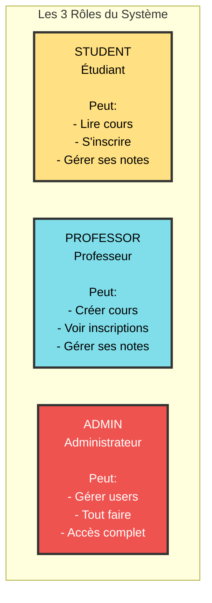
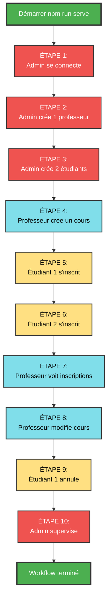

# Guide de Tests Complet - API Firebase Functions avec RBAC

Basé sur les fichiers de test réels du dossier `api-tests/`

---

## Schéma de la base de données Firestore



---

## GUIDE - Les 3 Rôles



### Rôle STUDENT (Étudiant)
### Rôle PROFESSOR (Professeur)
### Rôle ADMIN (Administrateur)

---

## 1 – Commencer par créer 3 utilisateurs

### IMPORTANT : Démarrez d'abord les émulateurs Firebase

```bash
npm run serve
```

Attendez que vous voyiez :
```
All emulators ready! It is now safe to connect your app.
```

---

### Utilisateur 1 - Admin

POST /v1/auth/signup

```json
{
  "email": "admin@school.com",
  "password": "admin123",
  "role": "admin",
  "firstName": "Super",
  "lastName": "Admin"
}
```

Réponse attendue : 201 Created

---

### Utilisateur 2 - Professor

POST /v1/auth/signup

```json
{
  "email": "prof.martin@school.com",
  "password": "prof123",
  "role": "professor",
  "firstName": "Jean",
  "lastName": "Martin"
}
```

Réponse attendue : 201 Created

---

### Utilisateur 3 - Student

POST /v1/auth/signup

```json
{
  "email": "sophie.dubois@school.com",
  "password": "student123",
  "role": "student",
  "firstName": "Sophie",
  "lastName": "Dubois"
}
```

Réponse attendue : 201 Created

---

## 2 – Comment se connecter et obtenir le token

### Utilisateur 1 – admin@school.com (ADMIN)

#### Login

POST http://localhost:9099/identitytoolkit.googleapis.com/v1/accounts:signInWithPassword?key=anything

```json
{
  "email": "admin@school.com",
  "password": "admin123",
  "returnSecureToken": true
}
```

Réponse : Vous obtenez un idToken

#### Profil courant

GET /v1/profile

Authorization: Bearer {TOKEN_OBTENU}

Ou simplement allez en haut à droite dans Swagger et collez le TOKEN_OBTENU (MÉTHODE PRÉFÉRÉE)

---

### Utilisateur 2 – prof.martin@school.com (PROFESSOR)

#### Login

POST http://localhost:9099/identitytoolkit.googleapis.com/v1/accounts:signInWithPassword?key=anything

```json
{
  "email": "prof.martin@school.com",
  "password": "prof123",
  "returnSecureToken": true
}
```

#### Profil courant

GET /v1/profile

Authorization: Bearer {TOKEN_PROFESSOR}

Ou simplement allez en haut à droite dans Swagger et collez le TOKEN_OBTENU (MÉTHODE PRÉFÉRÉE)

---

### Utilisateur 3 – sophie.dubois@school.com (STUDENT)

#### Login

POST http://localhost:9099/identitytoolkit.googleapis.com/v1/accounts:signInWithPassword?key=anything

```json
{
  "email": "sophie.dubois@school.com",
  "password": "student123",
  "returnSecureToken": true
}
```

#### Profil courant

GET /v1/profile

Authorization: Bearer {TOKEN_STUDENT}

Ou simplement allez en haut à droite dans Swagger et collez le TOKEN_OBTENU (MÉTHODE PRÉFÉRÉE)

---

## 3 - Testez les endpoints du rôle ADMINISTRATEUR

### Utilisateur 1 – admin@school.com (ADMIN)

#### 3.1 - Login

POST http://localhost:9099/identitytoolkit.googleapis.com/v1/accounts:signInWithPassword?key=anything

```json
{
  "email": "admin@school.com",
  "password": "admin123",
  "returnSecureToken": true
}
```

#### 3.2 – Ajout du token à Swagger

Ou simplement allez en haut à droite dans Swagger et collez le TOKEN_OBTENU (MÉTHODE PRÉFÉRÉE)

#### 3.3 - Profil courant

GET /v1/profile

---

### Checklist ADMIN – Résumé par Points

#### Gestion des Utilisateurs
- Créer un professeur (POST /v1/users)
- Créer un étudiant 1 (POST /v1/users)
- Créer un étudiant 2 (POST /v1/users)
- Lister tous les utilisateurs (GET /v1/users)
- Filtrer par rôle professeur (GET /v1/users?role=professor)
- Filtrer par rôle étudiant (GET /v1/users?role=student)
- Consulter un utilisateur spécifique (GET /v1/users/{uid})
- Modifier un utilisateur (PUT /v1/users/{uid})
- Changer le rôle d'un utilisateur (PUT /v1/users/{uid})
- Supprimer un utilisateur (DELETE /v1/users/{uid})

#### Profil
- Voir son profil admin (GET /v1/profile)
- Modifier son profil (PUT /v1/profile)

#### Accès aux Cours
- Lister tous les cours (GET /v1/courses)

---

### Tests ADMIN – Format JSON

```json
{
  "role": "ADMIN",
  "tests": {
    "users": [
      "POST /v1/users (créer professeur)",
      "POST /v1/users (créer étudiant 1)",
      "POST /v1/users (créer étudiant 2)",
      "GET /v1/users (lister tous)",
      "GET /v1/users?role=professor (filtrer professeurs)",
      "GET /v1/users?role=student (filtrer étudiants)",
      "GET /v1/users/{uid} (consulter spécifique)",
      "PUT /v1/users/{uid} (modifier utilisateur)",
      "PUT /v1/users/{uid} (changer rôle)",
      "DELETE /v1/users/{uid} (supprimer)"
    ],
    "profile": [
      "GET /v1/profile (voir profil)",
      "PUT /v1/profile (modifier profil)"
    ],
    "courses": [
      "GET /v1/courses (lister tous les cours)"
    ]
  }
}
```

Voir l'annexe pour des tests avec des corps de requête !

---

## Annexe 1 - Corps de Requêtes ADMIN

### USERS

#### POST /v1/users (créer professeur)

```json
{
  "email": "prof.martin@school.com",
  "password": "prof123",
  "role": "professor",
  "firstName": "Jean",
  "lastName": "Martin"
}
```

#### POST /v1/users (créer étudiant 1)

```json
{
  "email": "sophie.dubois@school.com",
  "password": "student123",
  "role": "student",
  "firstName": "Sophie",
  "lastName": "Dubois"
}
```

#### POST /v1/users (créer étudiant 2)

```json
{
  "email": "lucas.bernard@school.com",
  "password": "student123",
  "role": "student",
  "firstName": "Lucas",
  "lastName": "Bernard"
}
```

#### GET /v1/users (lister tous)

(pas de corps requis)

#### GET /v1/users?role=professor (filtrer professeurs)

(pas de corps requis)

#### GET /v1/users?role=student (filtrer étudiants)

(pas de corps requis)

#### GET /v1/users/{uid} (consulter spécifique)

(pas de corps requis)

#### PUT /v1/users/{uid} (modifier utilisateur)

```json
{
  "firstName": "Sophie Marie",
  "lastName": "Dubois"
}
```

#### PUT /v1/users/{uid} (changer rôle)

```json
{
  "role": "professor"
}
```

#### DELETE /v1/users/{uid} (supprimer)

(pas de corps requis - Attention !)

---

### PROFILE

#### GET /v1/profile (voir profil)

(pas de corps requis)

#### PUT /v1/profile (modifier profil)

```json
{
  "firstName": "Super",
  "lastName": "Administrateur"
}
```

---

### COURSES

#### GET /v1/courses (lister tous les cours)

(pas de corps requis)

---

## 4 - Testez les endpoints du rôle PROFESSOR

### Utilisateur 2 – prof.martin@school.com (PROFESSOR)

#### 4.1 – Login

POST http://localhost:9099/identitytoolkit.googleapis.com/v1/accounts:signInWithPassword?key=anything

```json
{
  "email": "prof.martin@school.com",
  "password": "prof123",
  "returnSecureToken": true
}
```

#### 4.2 – Ajout du token à Swagger

Ou simplement allez en haut à droite dans Swagger et collez le TOKEN_OBTENU (MÉTHODE PRÉFÉRÉE)

#### 4.3 – Profil courant

GET /v1/profile

(pas de corps requis)

---

### Checklist PROFESSOR – Résumé par points

#### Gestion du Profil
- Voir son profil (GET /v1/profile)
- Modifier son profil (PUT /v1/profile)

#### Gestion des Cours
- Créer un cours Python (POST /v1/courses)
- Créer un cours JavaScript (POST /v1/courses)
- Créer un cours TypeScript (POST /v1/courses)
- Lister MES cours (GET /v1/courses/my)
- Lister TOUS les cours disponibles (GET /v1/courses)
- Consulter un cours spécifique (GET /v1/courses/{id})
- Modifier un cours (PUT /v1/courses/{id})
- Supprimer un cours (DELETE /v1/courses/{id})

#### Consulter les Inscriptions
- Voir les inscriptions au cours Python (GET /v1/courses/{courseId}/enrollments)
- Voir les inscriptions au cours JavaScript (GET /v1/courses/{courseId}/enrollments)

#### Gestion des Notes Personnelles
- Créer une note (POST /v1/notes)
- Lister mes notes (GET /v1/notes)
- Modifier une note (PUT /v1/notes/{id})
- Supprimer une note (DELETE /v1/notes/{id})

#### Tests de Sécurité (doivent échouer)
- Un professeur ne peut PAS créer d'utilisateurs (POST /v1/users) → 403 attendu
- Un professeur ne peut PAS s'inscrire comme étudiant (POST /v1/enrollments) → 403 attendu

---

### Matrice PROFESSOR (rappel)

| Ressource | GET (list/one) | POST | PUT | DELETE |
|-----------|----------------|------|-----|--------|
| Users | NON (403) | NON (403) | NON (403) | NON (403) |
| Profile | OUI | - | OUI | - |
| Courses | OUI | OUI | OUI (ses cours) | OUI (ses cours) |
| Enrollments (voir) | OUI (ses cours) | NON (403) | - | - |
| Notes | OUI | OUI | OUI | OUI |

---

## Annexe 2 - Corps de Requêtes PROFESSOR

### PROFILE

#### GET /v1/profile (voir son profil)

(pas de corps requis)

#### PUT /v1/profile (modifier son profil)

```json
{
  "firstName": "Jean-Pierre",
  "lastName": "Martin"
}
```

---

### COURSES

#### POST /v1/courses (créer cours Python)

```json
{
  "title": "Introduction à Python",
  "description": "Apprendre les bases de la programmation Python pour débutants",
  "maxStudents": 30
}
```

#### POST /v1/courses (créer cours JavaScript)

```json
{
  "title": "JavaScript Avancé",
  "description": "Concepts avancés de JavaScript ES6+ et programmation asynchrone",
  "maxStudents": 25
}
```

#### POST /v1/courses (créer cours TypeScript)

```json
{
  "title": "TypeScript pour les développeurs JavaScript",
  "description": "Maîtriser TypeScript et le typage statique",
  "maxStudents": 20
}
```

#### GET /v1/courses/my (lister MES cours)

(pas de corps requis)

#### GET /v1/courses (lister TOUS les cours)

(pas de corps requis)

#### GET /v1/courses/{id} (consulter un cours)

(pas de corps requis)

#### PUT /v1/courses/{id} (modifier un cours)

```json
{
  "title": "Python pour Débutants - Édition 2025",
  "description": "Apprendre Python de zéro avec des exemples pratiques",
  "maxStudents": 35
}
```

#### DELETE /v1/courses/{id} (supprimer un cours)

(pas de corps requis - Commenté dans les tests)

---

### ENROLLMENTS (consultation uniquement)

#### GET /v1/courses/{courseId}/enrollments (voir inscriptions)

(pas de corps requis)

---

### NOTES

#### POST /v1/notes (créer une note)

```json
{
  "title": "Idées pour le cours Python",
  "content": "Ajouter des exercices sur les listes et dictionnaires. Prévoir un mini-projet final."
}
```

#### GET /v1/notes (lister mes notes)

(pas de corps requis)

#### PUT /v1/notes/{id} (modifier une note)

```json
{
  "title": "Plan du cours Python - Semaine 1",
  "content": "Jour 1: Variables et types\nJour 2: Conditions et boucles\nJour 3: Fonctions\nJour 4: Listes et tuples\nJour 5: Mini-projet"
}
```

#### DELETE /v1/notes/{id} (supprimer une note)

(pas de corps requis - Commenté dans les tests)

---

### Tests de Sécurité (doivent échouer)

#### Test 1: Un professeur ne peut PAS créer d'utilisateurs

POST /v1/users

```json
{
  "email": "unauthorized@test.com",
  "password": "test123",
  "role": "student",
  "firstName": "Test",
  "lastName": "Unauthorized"
}
```

Résultat attendu : 403 Forbidden

#### Test 2: Un professeur ne peut PAS s'inscrire comme étudiant

POST /v1/enrollments

```json
{
  "courseId": "n-importe-quel-id"
}
```

Résultat attendu : 403 Forbidden

---

## 5 - Testez les endpoints du rôle STUDENT

### Utilisateur 3 – sophie.dubois@school.com (STUDENT)

#### 5.1 – Login

POST http://localhost:9099/identitytoolkit.googleapis.com/v1/accounts:signInWithPassword?key=anything

```json
{
  "email": "sophie.dubois@school.com",
  "password": "student123",
  "returnSecureToken": true
}
```

#### 5.2 – Ajout du token à Swagger

Ou simplement allez en haut à droite dans Swagger et collez le TOKEN_OBTENU (MÉTHODE PRÉFÉRÉE)

#### 5.3 – Profil courant

GET /v1/profile

(pas de corps requis)

---

### Checklist STUDENT – Résumé par points

#### Gestion du Profil
- Voir son profil (GET /v1/profile)
- Modifier son profil (PUT /v1/profile)

#### Consulter les Cours
- Lister tous les cours disponibles (GET /v1/courses)
- Consulter un cours spécifique (GET /v1/courses/{id})

#### Inscriptions aux Cours
- S'inscrire au cours Python (POST /v1/enrollments)
- S'inscrire au cours JavaScript (POST /v1/enrollments)
- Voir MES inscriptions (GET /v1/enrollments/my)
- Annuler une inscription (DELETE /v1/enrollments/{id})

#### Gestion des Notes Personnelles
- Créer note de cours (POST /v1/notes)
- Créer note de révision (POST /v1/notes)
- Créer note de projet (POST /v1/notes)
- Lister toutes mes notes (GET /v1/notes)
- Consulter une note spécifique (GET /v1/notes/{id})
- Modifier une note (PUT /v1/notes/{id})
- Supprimer une note (DELETE /v1/notes/{id})

#### Tests de Sécurité (doivent échouer)
- Un étudiant ne peut PAS créer d'utilisateurs (POST /v1/users) → 403
- Un étudiant ne peut PAS créer de cours (POST /v1/courses) → 403
- Un étudiant ne peut PAS voir les inscriptions d'un cours (GET /v1/courses/{id}/enrollments) → 403
- Un étudiant ne peut PAS modifier un cours (PUT /v1/courses/{id}) → 403
- Un étudiant ne peut PAS lire les notes d'un autre étudiant (GET /v1/notes/{id_autre}) → 403

---

### Matrice STUDENT (rappel)

| Ressource | GET (list/one) | POST | PUT | DELETE |
|-----------|----------------|------|-----|--------|
| Users | NON (403) | NON (403) | NON (403) | NON (403) |
| Profile | OUI | - | OUI | - |
| Courses | OUI | NON (403) | NON (403) | NON (403) |
| Enrollments | OUI (mes inscriptions) | OUI | - | OUI |
| Notes | OUI (mes notes) | OUI | OUI | OUI |

---

## Annexe 3 - Corps de Requêtes STUDENT

### PROFILE

#### GET /v1/profile (voir son profil)

(pas de corps requis)

#### PUT /v1/profile (modifier son profil)

```json
{
  "firstName": "Sophie Marie",
  "lastName": "Dubois-Laurent"
}
```

---

### COURSES (lecture seule)

#### GET /v1/courses (lister tous les cours)

(pas de corps requis)

#### GET /v1/courses/{id} (consulter un cours)

(pas de corps requis - Remplacer {courseId} par un ID réel)

---

### ENROLLMENTS

#### POST /v1/enrollments (s'inscrire au cours Python)

```json
{
  "courseId": "REMPLACER_PAR_ID_COURS_PYTHON"
}
```

#### POST /v1/enrollments (s'inscrire au cours JavaScript)

```json
{
  "courseId": "REMPLACER_PAR_ID_COURS_JS"
}
```

#### GET /v1/enrollments/my (voir MES inscriptions)

(pas de corps requis)

#### DELETE /v1/enrollments/{id} (annuler une inscription)

(pas de corps requis - Commenté dans les tests)

---

### NOTES

#### POST /v1/notes (créer note de cours)

```json
{
  "title": "Résumé Python - Semaine 1",
  "content": "Variables: int, str, float, bool\nOpérateurs: +, -, *, /, //, %, **\nInput: input()\nOutput: print()"
}
```

#### POST /v1/notes (créer note de révision)

```json
{
  "title": "À réviser pour l'examen",
  "content": "- Les fonctions lambda\n- List comprehension\n- Gestion des exceptions\n- Modules et packages"
}
```

#### POST /v1/notes (créer note de projet)

```json
{
  "title": "Idées de projet final",
  "content": "Option 1: Application de gestion de tâches\nOption 2: Jeu de devinettes\nOption 3: Analyseur de fichiers CSV"
}
```

#### GET /v1/notes (lister toutes mes notes)

(pas de corps requis)

#### GET /v1/notes/{id} (consulter une note)

(pas de corps requis)

#### PUT /v1/notes/{id} (modifier une note)

```json
{
  "title": "Python - Chapitre 1: Les Bases",
  "content": "# Variables\nnom = 'Sophie'\nage = 22\nestEtudiant = True\n\n# Affichage\nprint(f'Je m'appelle {nom} et j'ai {age} ans')\n\n# Input\nreponse = input('Votre nom: ')"
}
```

#### DELETE /v1/notes/{id} (supprimer une note)

(pas de corps requis - Commenté dans les tests)

---

### Tests de Sécurité (doivent échouer)

#### Test 1: Un étudiant ne peut PAS créer d'utilisateurs

POST /v1/users

```json
{
  "email": "unauthorized@test.com",
  "password": "test123",
  "role": "student",
  "firstName": "Test",
  "lastName": "Test"
}
```

Résultat attendu : 403 Forbidden

#### Test 2: Un étudiant ne peut PAS créer de cours

POST /v1/courses

```json
{
  "title": "Cours non autorisé",
  "description": "Ceci devrait échouer",
  "maxStudents": 10
}
```

Résultat attendu : 403 Forbidden

---

### Astuces pratiques

- Commence par GET /v1/courses pour récupérer les IDs de cours disponibles
- Garde les IDs de tes inscriptions et notes sous la main pour tester PUT/DELETE/GET
- Si un appel échoue : vérifie token (cadenas) → rôle → ID → JSON

---

## WORKFLOW COMPLET - Scénario de A à Z



### Étape 1: Se connecter en tant qu'ADMIN

POST http://localhost:9099/identitytoolkit.googleapis.com/v1/accounts:signInWithPassword?key=anything

```json
{
  "email": "admin@school.com",
  "password": "admin123",
  "returnSecureToken": true
}
```

---

### Étape 2: ADMIN crée un professeur

POST /v1/users

```json
{
  "email": "marie.leclerc@school.com",
  "password": "prof456",
  "role": "professor",
  "firstName": "Marie",
  "lastName": "Leclerc"
}
```

---

### Étape 3: ADMIN crée deux étudiants

POST /v1/users

```json
{
  "email": "paul.dupont@school.com",
  "password": "student456",
  "role": "student",
  "firstName": "Paul",
  "lastName": "Dupont"
}
```

POST /v1/users

```json
{
  "email": "emma.rousseau@school.com",
  "password": "student456",
  "role": "student",
  "firstName": "Emma",
  "lastName": "Rousseau"
}
```

#### Vérifier les utilisateurs créés

GET /v1/users

---

### Étape 4: PROFESSEUR se connecte et crée un cours

#### Login professeur

POST http://localhost:9099/identitytoolkit.googleapis.com/v1/accounts:signInWithPassword?key=anything

```json
{
  "email": "marie.leclerc@school.com",
  "password": "prof456",
  "returnSecureToken": true
}
```

#### Professeur crée un cours

POST /v1/courses

```json
{
  "title": "Développement Web Full Stack",
  "description": "Créer des applications web modernes avec React et Node.js",
  "maxStudents": 15
}
```

#### Professeur vérifie ses cours

GET /v1/courses/my

---

### Étape 5: ÉTUDIANT 1 s'inscrit au cours

#### Login étudiant 1

POST http://localhost:9099/identitytoolkit.googleapis.com/v1/accounts:signInWithPassword?key=anything

```json
{
  "email": "paul.dupont@school.com",
  "password": "student456",
  "returnSecureToken": true
}
```

#### Étudiant 1 consulte les cours disponibles

GET /v1/courses

#### Étudiant 1 s'inscrit au cours

POST /v1/enrollments

```json
{
  "courseId": "ID_DU_COURS_CRÉÉ"
}
```

#### Étudiant 1 crée une note

POST /v1/notes

```json
{
  "title": "Premier jour de cours",
  "content": "Introduction au développement web. Stack technologique: HTML, CSS, JavaScript, React, Node.js"
}
```

---

### Étape 6: ÉTUDIANT 2 s'inscrit aussi

#### Login étudiant 2

POST http://localhost:9099/identitytoolkit.googleapis.com/v1/accounts:signInWithPassword?key=anything

```json
{
  "email": "emma.rousseau@school.com",
  "password": "student456",
  "returnSecureToken": true
}
```

#### Étudiant 2 s'inscrit au même cours

POST /v1/enrollments

```json
{
  "courseId": "ID_DU_MÊME_COURS"
}
```

#### Étudiant 2 vérifie ses inscriptions

GET /v1/enrollments/my

---

### Étape 7: PROFESSEUR consulte les inscriptions

GET /v1/courses/{courseId}/enrollments

#### Professeur consulte les détails du cours

GET /v1/courses/{courseId}

---

### Étape 8: PROFESSEUR modifie le cours

PUT /v1/courses/{courseId}

```json
{
  "description": "Créer des applications web modernes avec React, Node.js et MongoDB. Projet final inclus.",
  "maxStudents": 20
}
```

---

### Étape 9: ÉTUDIANT 1 annule son inscription

DELETE /v1/enrollments/{enrollmentId}

#### Vérifier que l'inscription est annulée

GET /v1/enrollments/my

---

### Étape 10: ADMIN consulte tout le système

#### Tous les utilisateurs

GET /v1/users

#### Tous les cours

GET /v1/courses

---

## RÉSUMÉ DU SCÉNARIO

- Admin créé et connecté
- 1 Professeur créé (Marie Leclerc)
- 2 Étudiants créés (Paul, Emma)
- 1 Cours créé (Développement Web Full Stack)
- 2 Inscriptions effectuées
- 1 Annulation d'inscription
- Notes créées par les étudiants
- Professeur consulte les inscriptions
- Admin supervise le système

---

## Matrice Complète des Permissions

| Endpoint | ADMIN | PROFESSOR | STUDENT |
|----------|-------|-----------|---------|
| **Profile** | | | |
| GET /v1/profile | OUI | OUI | OUI |
| PUT /v1/profile | OUI | OUI | OUI |
| **Users** | | | |
| POST /v1/users | OUI | NON (403) | NON (403) |
| GET /v1/users | OUI | NON (403) | NON (403) |
| GET /v1/users?role=X | OUI | NON (403) | NON (403) |
| GET /v1/users/{uid} | OUI | NON (403) | NON (403) |
| PUT /v1/users/{uid} | OUI | NON (403) | NON (403) |
| DELETE /v1/users/{uid} | OUI | NON (403) | NON (403) |
| **Courses** | | | |
| GET /v1/courses | OUI | OUI | OUI |
| POST /v1/courses | OUI | OUI | NON (403) |
| GET /v1/courses/{id} | OUI | OUI | OUI |
| PUT /v1/courses/{id} | OUI | OUI (ses cours) | NON (403) |
| DELETE /v1/courses/{id} | OUI | OUI (ses cours) | NON (403) |
| GET /v1/courses/my | OUI | OUI | NON (403) |
| GET /v1/courses/{id}/enrollments | OUI | OUI (ses cours) | NON (403) |
| **Enrollments** | | | |
| POST /v1/enrollments | OUI | NON (403) | OUI |
| GET /v1/enrollments/my | OUI | NON (403) | OUI |
| DELETE /v1/enrollments/{id} | OUI | NON (403) | OUI |
| **Notes** | | | |
| GET /v1/notes | OUI | OUI | OUI |
| POST /v1/notes | OUI | OUI | OUI |
| GET /v1/notes/{id} | OUI | OUI | OUI (ses notes) |
| PUT /v1/notes/{id} | OUI | OUI (ses notes) | OUI (ses notes) |
| DELETE /v1/notes/{id} | OUI | OUI (ses notes) | OUI (ses notes) |

---

**Date** : 6 octobre 2025  
**Version** : 1.0 - Basé sur les fichiers api-tests/ réels  
**Projet** : Firebase Functions REST API avec RBAC  
**Fichiers source** : api-tests/01-auth.http, 01-admin.http, 02-professor.http, 03-student.http, 04-workflow-complet.http

