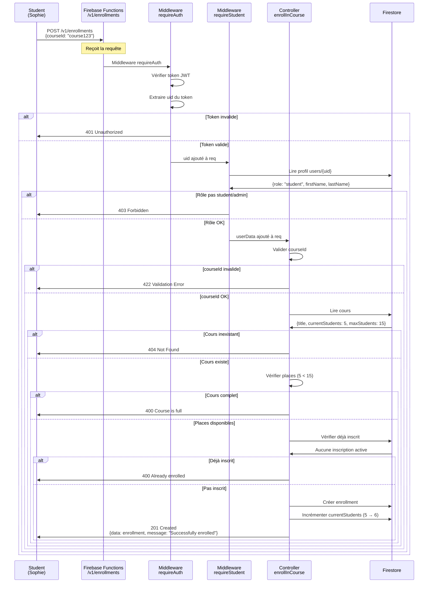

# Guide Ultime Complet - Tests API Firebase avec RBAC

Basé sur TOUS les fichiers du projet (api-tests/, 16.txt, code source)

---

## Schéma de la base de données Firestore


---

## SUITE GUIDE (Les 3 rôles)

### Les 3 rôles


- Rôle ADMIN
- Rôle PROFESSOR  
- Rôle STUDENT

---

## DÉMARRAGE ULTRA-RAPIDE

### Checklist en 3 étapes

#### Étape 1 : Installer l'extension REST Client

1. Ouvrez VS Code/Cursor
2. Allez dans Extensions (Ctrl+Shift+X)
3. Recherchez "REST Client"
4. Installez l'extension par Huachao Mao

#### Étape 2 : Démarrer les émulateurs

```bash
npm run serve
```

Attendez de voir :
```
functions[us-central1-api]: http function initialized
All emulators ready!
```

#### Étape 3 : Suivre le scénario guidé

1. Ouvrez le fichier `api-tests/06-SCENARIO-GUIDE.http`
2. Suivez les instructions étape par étape
3. Cliquez sur "Send Request" au-dessus de chaque requête

---

## 1 – Commencer par créer 3 utilisateurs

### Utilisateur 1 - Admin

POST /v1/auth/signup

```json
{
  "email": "admin@school.com",
  "password": "admin123",
  "role": "admin",
  "firstName": "Super",
  "lastName": "Admin"
}
```

Réponse attendue : 201 Created

### Utilisateur 2 - Professor

POST /v1/auth/signup

```json
{
  "email": "prof.martin@school.com",
  "password": "prof123",
  "role": "professor",
  "firstName": "Jean",
  "lastName": "Martin"
}
```

Réponse attendue : 201 Created

### Utilisateur 3 - Student

POST /v1/auth/signup

```json
{
  "email": "sophie.dubois@school.com",
  "password": "student123",
  "role": "student",
  "firstName": "Sophie",
  "lastName": "Dubois"
}
```

Réponse attendue : 201 Created

---

## 2 – Comment changer d'utilisateur et de rôle ?

### Processus de Connexion


---

### Utilisateur 1 – admin@school.com (ADMIN)

#### Login

POST http://localhost:9099/identitytoolkit.googleapis.com/v1/accounts:signInWithPassword?key=anything

```json
{
  "email": "admin@school.com",
  "password": "admin123",
  "returnSecureToken": true
}
```

#### Profil courant

GET /v1/profile

Authorization: Bearer {TOKEN_OBTENU}

Ou simplement allez en haut à droite dans Swagger et collez le TOKEN_OBTENU (MÉTHODE PRÉFÉRÉE)

---

### Utilisateur 2 – prof.martin@school.com (PROFESSOR)

#### Login

POST http://localhost:9099/identitytoolkit.googleapis.com/v1/accounts:signInWithPassword?key=anything

```json
{
  "email": "prof.martin@school.com",
  "password": "prof123",
  "returnSecureToken": true
}
```

#### Profil courant

GET /v1/profile

Authorization: Bearer {TOKEN_PROFESSOR}

Ou simplement allez en haut à droite dans Swagger et collez le TOKEN_OBTENU (MÉTHODE PRÉFÉRÉE)

---

### Utilisateur 3 – sophie.dubois@school.com (STUDENT)

#### Login

POST http://localhost:9099/identitytoolkit.googleapis.com/v1/accounts:signInWithPassword?key=anything

```json
{
  "email": "sophie.dubois@school.com",
  "password": "student123",
  "returnSecureToken": true
}
```

#### Profil courant

GET /v1/profile

Authorization: Bearer {TOKEN_STUDENT}

Ou simplement allez en haut à droite dans Swagger et collez le TOKEN_OBTENU (MÉTHODE PRÉFÉRÉE)

---

## 3 - Testez les endpoints du rôle ADMINISTRATEUR

### Utilisateur 1 – admin@school.com (ADMIN)

#### 3.1 - Login

POST http://localhost:9099/identitytoolkit.googleapis.com/v1/accounts:signInWithPassword?key=anything

```json
{
  "email": "admin@school.com",
  "password": "admin123",
  "returnSecureToken": true
}
```

#### 3.2 – Ajout du token à Swagger

Ou simplement allez en haut à droite dans Swagger et collez le TOKEN_OBTENU (MÉTHODE PRÉFÉRÉE)

#### 3.3 - Profil courant

GET /v1/profile

---

### Checklist ADMIN – Résumé par Points

#### Authentification
- Inscription (POST /v1/auth/signup)
- Connexion (POST /accounts:signInWithPassword)
- Vérifier profil (GET /v1/profile)

#### Tests sur Users
- Créer un professeur (POST /v1/users)
- Créer un étudiant 1 (POST /v1/users)
- Créer un étudiant 2 (POST /v1/users)
- Lire tous les utilisateurs (GET /v1/users)
- Filtrer utilisateurs par rôle professor (GET /v1/users?role=professor)
- Filtrer utilisateurs par rôle student (GET /v1/users?role=student)
- Consulter un utilisateur spécifique (GET /v1/users/{uid})
- Modifier un utilisateur (PUT /v1/users/{uid})
- Changer le rôle d'un utilisateur (PUT /v1/users/{uid})
- Supprimer un utilisateur (DELETE /v1/users/{uid})

#### Tests sur Profile
- Voir son profil admin (GET /v1/profile)
- Modifier son profil (PUT /v1/profile)

#### Tests sur Courses
- Lister tous les cours (GET /v1/courses)

---

### Tests ADMIN – Format JSON

```json
{
  "role": "ADMIN",
  "tests": {
    "auth": [
      "POST /v1/auth/signup (inscription)",
      "POST /accounts:signInWithPassword (connexion)",
      "GET /v1/profile (profil)"
    ],
    "users": [
      "POST /v1/users (créer professeur)",
      "POST /v1/users (créer étudiant 1)",
      "POST /v1/users (créer étudiant 2)",
      "GET /v1/users (lire tous)",
      "GET /v1/users?role=professor (filtrer professeurs)",
      "GET /v1/users?role=student (filtrer étudiants)",
      "GET /v1/users/{uid} (consulter spécifique)",
      "PUT /v1/users/{uid} (modifier)",
      "PUT /v1/users/{uid} (changer rôle)",
      "DELETE /v1/users/{uid} (supprimer)"
    ],
    "profile": [
      "GET /v1/profile (voir profil)",
      "PUT /v1/profile (modifier profil)"
    ],
    "courses": [
      "GET /v1/courses (lister tous)"
    ]
  }
}
```

Voir l'annexe pour des tests avec des corps de requête !

---

## Annexe 1 - Corps de Requêtes ADMIN

### AUTH

#### POST /v1/auth/signup (inscription)

```json
{
  "email": "admin@school.com",
  "password": "admin123",
  "role": "admin",
  "firstName": "Super",
  "lastName": "Admin"
}
```

#### POST /accounts:signInWithPassword (connexion)

```json
{
  "email": "admin@school.com",
  "password": "admin123",
  "returnSecureToken": true
}
```

#### GET /v1/profile (profil)

(pas de corps requis)

---

### USERS

#### POST /v1/users (créer professeur)

```json
{
  "email": "prof.martin@school.com",
  "password": "prof123",
  "role": "professor",
  "firstName": "Jean",
  "lastName": "Martin"
}
```

#### POST /v1/users (créer étudiant 1)

```json
{
  "email": "sophie.dubois@school.com",
  "password": "student123",
  "role": "student",
  "firstName": "Sophie",
  "lastName": "Dubois"
}
```

#### POST /v1/users (créer étudiant 2)

```json
{
  "email": "lucas.bernard@school.com",
  "password": "student123",
  "role": "student",
  "firstName": "Lucas",
  "lastName": "Bernard"
}
```

#### GET /v1/users (lire tous)

(pas de corps requis)

#### GET /v1/users?role=professor (filtrer professeurs)

(pas de corps requis)

#### GET /v1/users?role=student (filtrer étudiants)

(pas de corps requis)

#### GET /v1/users/{uid} (consulter spécifique)

(pas de corps requis)

#### PUT /v1/users/{uid} (modifier)

```json
{
  "firstName": "Sophie Marie",
  "lastName": "Dubois"
}
```

#### PUT /v1/users/{uid} (changer rôle)

```json
{
  "role": "professor"
}
```

#### DELETE /v1/users/{uid} (supprimer)

(pas de corps requis)

---

### PROFILE

#### GET /v1/profile (voir profil)

(pas de corps requis)

#### PUT /v1/profile (modifier profil)

```json
{
  "firstName": "Super",
  "lastName": "Administrateur"
}
```

---

### COURSES

#### GET /v1/courses (lister tous)

(pas de corps requis)

---

## 4 - Testez les endpoints du rôle PROFESSOR

### Utilisateur 2 – prof.martin@school.com (PROFESSOR)

#### 4.1 – Login

POST http://localhost:9099/identitytoolkit.googleapis.com/v1/accounts:signInWithPassword?key=anything

```json
{
  "email": "prof.martin@school.com",
  "password": "prof123",
  "returnSecureToken": true
}
```

#### 4.2 – Ajout du token à Swagger

Ou simplement allez en haut à droite dans Swagger et collez le TOKEN_OBTENU (MÉTHODE PRÉFÉRÉE)

#### 4.3 – Profil courant

GET /v1/profile

(pas de corps requis)

---

### Checklist PROFESSOR – Résumé par points

#### Authentification
- Connexion (POST /accounts:signInWithPassword)
- Vérifier profil (GET /v1/profile)

#### Profile
- Voir son profil (GET /v1/profile)
- Modifier son profil (PUT /v1/profile)

#### Courses (PROFESSOR peut créer/lire/modifier/supprimer ses cours)
- Créer cours Python (POST /v1/courses)
- Créer cours JavaScript (POST /v1/courses)
- Créer cours TypeScript (POST /v1/courses)
- Lister MES cours (GET /v1/courses/my)
- Lister TOUS les cours (GET /v1/courses)
- Consulter un cours spécifique (GET /v1/courses/{id})
- Modifier un cours (PUT /v1/courses/{id})
- Supprimer un cours (DELETE /v1/courses/{id})

#### Enrollments (consultation uniquement)
- Voir inscriptions au cours Python (GET /v1/courses/{courseId}/enrollments)
- Voir inscriptions au cours JavaScript (GET /v1/courses/{courseId}/enrollments)

#### Notes (PROFESSOR a CRUD complet)
- Créer une note (POST /v1/notes)
- Lister mes notes (GET /v1/notes)
- Modifier une note (PUT /v1/notes/{id})
- Supprimer une note (DELETE /v1/notes/{id})

#### Tests négatifs / validations
- Un professeur ne peut PAS créer d'utilisateurs (POST /v1/users) → 403 attendu
- Un professeur ne peut PAS s'inscrire comme étudiant (POST /v1/enrollments) → 403 attendu

---

### Matrice PROFESSOR (rappel)

| Ressource | GET (list/one) | POST | PUT | DELETE |
|-----------|----------------|------|-----|--------|
| Users | NON (403) | NON (403) | NON (403) | NON (403) |
| Profile | OUI | - | OUI | - |
| Courses | OUI | OUI | OUI (ses cours) | OUI (ses cours) |
| Enrollments | OUI (ses cours) | NON (403) | - | - |
| Notes | OUI | OUI | OUI | OUI |

---

## Annexe 2 - Corps de Requêtes PROFESSOR

### PROFILE

#### GET /v1/profile (voir profil)

(pas de corps requis)

#### PUT /v1/profile (modifier profil)

```json
{
  "firstName": "Jean-Pierre",
  "lastName": "Martin"
}
```

---

### COURSES

#### POST /v1/courses (créer cours Python)

```json
{
  "title": "Introduction à Python",
  "description": "Apprendre les bases de la programmation Python pour débutants",
  "maxStudents": 30
}
```

#### POST /v1/courses (créer cours JavaScript)

```json
{
  "title": "JavaScript Avancé",
  "description": "Concepts avancés de JavaScript ES6+ et programmation asynchrone",
  "maxStudents": 25
}
```

#### POST /v1/courses (créer cours TypeScript)

```json
{
  "title": "TypeScript pour les développeurs JavaScript",
  "description": "Maîtriser TypeScript et le typage statique",
  "maxStudents": 20
}
```

#### GET /v1/courses/my (lister MES cours)

(pas de corps requis)

#### GET /v1/courses (lister TOUS les cours)

(pas de corps requis)

#### GET /v1/courses/{id} (consulter un cours)

(pas de corps requis)

#### PUT /v1/courses/{id} (modifier)

```json
{
  "title": "Python pour Débutants - Édition 2025",
  "description": "Apprendre Python de zéro avec des exemples pratiques",
  "maxStudents": 35
}
```

#### DELETE /v1/courses/{id} (supprimer)

(pas de corps requis)

---

### ENROLLMENTS

#### GET /v1/courses/{courseId}/enrollments (voir inscriptions)

(pas de corps requis)

---

### NOTES

#### POST /v1/notes (créer)

```json
{
  "title": "Idées pour le cours Python",
  "content": "Ajouter des exercices sur les listes et dictionnaires. Prévoir un mini-projet final."
}
```

#### GET /v1/notes (lister mes notes)

(pas de corps requis)

#### PUT /v1/notes/{id} (modifier)

```json
{
  "title": "Plan du cours Python - Semaine 1",
  "content": "Jour 1: Variables et types\nJour 2: Conditions et boucles\nJour 3: Fonctions\nJour 4: Listes et tuples\nJour 5: Mini-projet"
}
```

#### DELETE /v1/notes/{id} (supprimer)

(pas de corps requis)

---

### Cas négatifs conseillés (rapides)

#### POST /v1/users (PROFESSOR → 403)

```json
{
  "email": "unauthorized@test.com",
  "password": "test123",
  "role": "student",
  "firstName": "Test",
  "lastName": "Unauthorized"
}
```

#### POST /v1/enrollments (PROFESSOR → 403)

```json
{
  "courseId": "n-importe-quel-id"
}
```

---

### Astuces pratiques

- Utilise d'abord GET /v1/courses pour récupérer les IDs de cours
- Garde à portée les IDs créés (Courses & Notes) pour enchaîner PUT/DELETE/GET
- Si un appel échoue :
  - Vérifier le token (cadenas Swagger)
  - Vérifier le rôle (GET /v1/profile)
  - Vérifier l'ID
  - Valider le JSON

---

## 5 - Testez les endpoints du rôle STUDENT

### Utilisateur 3 – sophie.dubois@school.com (STUDENT)

#### 5.1 – Login

POST http://localhost:9099/identitytoolkit.googleapis.com/v1/accounts:signInWithPassword?key=anything

```json
{
  "email": "sophie.dubois@school.com",
  "password": "student123",
  "returnSecureToken": true
}
```

#### 5.2 – Ajout du token à Swagger

Ou simplement allez en haut à droite dans Swagger et collez le TOKEN_OBTENU (MÉTHODE PRÉFÉRÉE)

#### 5.3 – Profil courant

GET /v1/profile

(pas de corps requis)

---

### Checklist STUDENT – Résumé par points

#### Authentification
- Connexion (POST /accounts:signInWithPassword)
- Voir profil (GET /v1/profile)

#### Profile
- Voir son profil (GET /v1/profile)
- Modifier son profil (PUT /v1/profile)

#### Courses (STUDENT = lecture seule)
- Lister tous les cours (GET /v1/courses)
- Consulter un cours spécifique (GET /v1/courses/{id})
- Créer un cours (POST /v1/courses) → 403 attendu
- Modifier un cours (PUT /v1/courses/{id}) → 403 attendu
- Supprimer un cours (DELETE /v1/courses/{id}) → 403 attendu

#### Enrollments (STUDENT = créer, voir, annuler)
- S'inscrire au cours Python (POST /v1/enrollments)
- S'inscrire au cours JavaScript (POST /v1/enrollments)
- Voir MES inscriptions (GET /v1/enrollments/my)
- Annuler une inscription (DELETE /v1/enrollments/{id})

#### Notes (STUDENT = CRUD complet)
- Créer note de cours (POST /v1/notes)
- Créer note de révision (POST /v1/notes)
- Créer note de projet (POST /v1/notes)
- Lister toutes mes notes (GET /v1/notes)
- Consulter une note spécifique (GET /v1/notes/{id})
- Modifier une note (PUT /v1/notes/{id})
- Supprimer une note (DELETE /v1/notes/{id})

#### Tests négatifs / validations
- Un étudiant ne peut PAS créer d'utilisateurs (POST /v1/users) → 403
- Un étudiant ne peut PAS créer de cours (POST /v1/courses) → 403
- Un étudiant ne peut PAS voir inscriptions d'un cours (GET /v1/courses/{id}/enrollments) → 403
- Un étudiant ne peut PAS modifier un cours (PUT /v1/courses/{id}) → 403
- Un étudiant ne peut PAS lire notes d'un autre (GET /v1/notes/{id_autre}) → 403

---

### Matrice STUDENT (rappel)

| Ressource | GET (list/one) | POST | PUT | DELETE |
|-----------|----------------|------|-----|--------|
| Users | NON (403) | NON (403) | NON (403) | NON (403) |
| Profile | OUI | - | OUI | - |
| Courses | OUI | NON (403) | NON (403) | NON (403) |
| Enrollments | OUI (mes inscriptions) | OUI | - | OUI |
| Notes | OUI (mes notes) | OUI | OUI | OUI |

---

## Annexe 3 - Corps de Requêtes STUDENT

### AUTH

#### POST /accounts:signInWithPassword (connexion)

```json
{
  "email": "sophie.dubois@school.com",
  "password": "student123",
  "returnSecureToken": true
}
```

#### GET /v1/profile (profil)

(pas de corps requis)

---

### PROFILE

#### GET /v1/profile (voir profil)

(pas de corps requis)

#### PUT /v1/profile (modifier profil)

```json
{
  "firstName": "Sophie Marie",
  "lastName": "Dubois-Laurent"
}
```

---

### COURSES (lecture seule)

#### GET /v1/courses (lister tous)

(pas de corps requis)

#### GET /v1/courses/{id} (consulter un cours)

(pas de corps requis)

#### POST /v1/courses (doit échouer → 403)

```json
{
  "title": "Cours non autorisé",
  "description": "Ceci devrait échouer",
  "maxStudents": 10
}
```

#### PUT /v1/courses/{id} (doit échouer → 403)

```json
{
  "title": "Modification non autorisée"
}
```

#### DELETE /v1/courses/{id} (doit échouer → 403)

(pas de corps requis)

---

### ENROLLMENTS

Remplace courseId par un ID réel de cours (créé par Admin/Professor).

#### POST /v1/enrollments (s'inscrire au Python)

```json
{
  "courseId": "REMPLACER_PAR_ID_COURS_PYTHON"
}
```

#### POST /v1/enrollments (s'inscrire au JavaScript)

```json
{
  "courseId": "REMPLACER_PAR_ID_COURS_JS"
}
```

#### GET /v1/enrollments/my (voir MES inscriptions)

(pas de corps requis)

#### DELETE /v1/enrollments/{id} (annuler)

(pas de corps requis)

---

### NOTES

#### POST /v1/notes (créer note de cours)

```json
{
  "title": "Résumé Python - Semaine 1",
  "content": "Variables: int, str, float, bool\nOpérateurs: +, -, *, /, //, %, **\nInput: input()\nOutput: print()"
}
```

#### POST /v1/notes (créer note de révision)

```json
{
  "title": "À réviser pour l'examen",
  "content": "- Les fonctions lambda\n- List comprehension\n- Gestion des exceptions\n- Modules et packages"
}
```

#### POST /v1/notes (créer note de projet)

```json
{
  "title": "Idées de projet final",
  "content": "Option 1: Application de gestion de tâches\nOption 2: Jeu de devinettes\nOption 3: Analyseur de fichiers CSV"
}
```

#### GET /v1/notes (lister toutes)

(pas de corps requis)

#### GET /v1/notes/{id} (consulter une)

(pas de corps requis)

#### PUT /v1/notes/{id} (modifier)

```json
{
  "title": "Python - Chapitre 1: Les Bases",
  "content": "# Variables\nnom = 'Sophie'\nage = 22\nestEtudiant = True\n\n# Affichage\nprint(f'Je m'appelle {nom} et j'ai {age} ans')\n\n# Input\nreponse = input('Votre nom: ')"
}
```

#### DELETE /v1/notes/{id} (supprimer)

(pas de corps requis)

---

### Cas négatifs conseillés (rapides)

#### POST /v1/users (STUDENT → 403)

```json
{
  "email": "unauthorized@test.com",
  "password": "test123",
  "role": "student",
  "firstName": "Test",
  "lastName": "Test"
}
```

#### POST /v1/courses (STUDENT → 403)

```json
{
  "title": "Cours non autorisé",
  "description": "Ceci devrait échouer",
  "maxStudents": 10
}
```

#### GET /v1/courses/{courseId}/enrollments (STUDENT → 403)

(pas de corps requis)

---

### Astuces pratiques

- Commence par GET /v1/courses pour récupérer les IDs de cours disponibles
- Garde les IDs de tes inscriptions et notes sous la main pour tester PUT/DELETE/GET
- Si un appel échoue : vérifie token → rôle (GET /v1/profile) → ID → JSON

---

## WORKFLOW COMPLET - Scénario de A à Z

### Vue d'ensemble du scénario


### Timeline du Scénario

```
ADMIN                      PROFESSEUR                ÉTUDIANTS
    │                            │                          │
    │ Étape 1-4                  │                          │
    │ Créer système              │                          │
    │ ├─ Créer prof ────────────>│                          │
    │ ├─ Créer Sophie ──────────────────────────────────────>│
    │ └─ Créer Lucas ───────────────────────────────────────>│
    │                            │                          │
    │                            │ Étape 5-7                │
    │                            │ Créer cours              │
    │                            │ ├─ Python                │
    │                            │ └─ JavaScript            │
    │                            │                          │
    │                            │                          │ Étape 8-12
    │                            │                          │ Sophie s'inscrit
    │                            │<─────────────────────────┤ ├─ Cours Python
    │                            │<─────────────────────────┤ ├─ Cours JS
    │                            │                          │ └─ Prend notes
    │                            │                          │
    │                            │                          │ Étape 13-14
    │                            │                          │ Lucas s'inscrit
    │                            │<─────────────────────────┤ └─ Cours Python
    │                            │                          │
    │                            │ Étape 15-16              │
    │                            │ Consulter inscriptions   │
    │                            │ ├─ Python: 2 étudiants  │
    │                            │ └─ JS: 1 étudiant       │
    │                            │ Modifier cours           │
    │                            │                          │
    │                            │                          │ Étape 17
    │                            │<─────────────────────────┤ Sophie annule
    │                            │                          │ └─ Annule JS
    │                            │                          │
    │ Étape 18                   │                          │
    │ Rapport système            │                          │
    │ ├─ 4 users total           │                          │
    │ ├─ 2 cours total           │                          │
    │ └─ 2 inscriptions actives  │                          │
    │                            │                          │
    ▼                            ▼                          ▼
```

---

### Étape 1: Se connecter en tant qu'ADMIN

POST http://localhost:9099/identitytoolkit.googleapis.com/v1/accounts:signInWithPassword?key=anything

```json
{
  "email": "admin@school.com",
  "password": "admin123",
  "returnSecureToken": true
}
```

---

### Étape 2: ADMIN crée un professeur

POST /v1/users

```json
{
  "email": "marie.leclerc@school.com",
  "password": "prof456",
  "role": "professor",
  "firstName": "Marie",
  "lastName": "Leclerc"
}
```

---

### Étape 3: ADMIN crée deux étudiants

#### Étudiant 1

POST /v1/users

```json
{
  "email": "paul.dupont@school.com",
  "password": "student456",
  "role": "student",
  "firstName": "Paul",
  "lastName": "Dupont"
}
```

#### Étudiant 2

POST /v1/users

```json
{
  "email": "emma.rousseau@school.com",
  "password": "student456",
  "role": "student",
  "firstName": "Emma",
  "lastName": "Rousseau"
}
```

---

### Étape 4: Vérifier les utilisateurs créés

GET /v1/users

---

### Étape 5: PROFESSEUR se connecte

POST http://localhost:9099/identitytoolkit.googleapis.com/v1/accounts:signInWithPassword?key=anything

```json
{
  "email": "marie.leclerc@school.com",
  "password": "prof456",
  "returnSecureToken": true
}
```

---

### Étape 6: Professeur crée un cours

POST /v1/courses

```json
{
  "title": "Développement Web Full Stack",
  "description": "Créer des applications web modernes avec React et Node.js",
  "maxStudents": 15
}
```

---

### Étape 7: Professeur vérifie ses cours

GET /v1/courses/my

---

### Étape 8: ÉTUDIANT 1 se connecte

POST http://localhost:9099/identitytoolkit.googleapis.com/v1/accounts:signInWithPassword?key=anything

```json
{
  "email": "paul.dupont@school.com",
  "password": "student456",
  "returnSecureToken": true
}
```

---

### Étape 9: Étudiant 1 consulte les cours

GET /v1/courses

---

### Étape 10: Étudiant 1 s'inscrit au cours

POST /v1/enrollments

```json
{
  "courseId": "ID_DU_COURS_CRÉÉ"
}
```

---

### Étape 11: Étudiant 1 crée une note

POST /v1/notes

```json
{
  "title": "Premier jour de cours",
  "content": "Introduction au développement web. Stack technologique: HTML, CSS, JavaScript, React, Node.js"
}
```

---

### Étape 12: ÉTUDIANT 2 se connecte et s'inscrit

POST http://localhost:9099/identitytoolkit.googleapis.com/v1/accounts:signInWithPassword?key=anything

```json
{
  "email": "emma.rousseau@school.com",
  "password": "student456",
  "returnSecureToken": true
}
```

POST /v1/enrollments

```json
{
  "courseId": "ID_DU_MÊME_COURS"
}
```

GET /v1/enrollments/my

---

### Étape 13: PROFESSEUR consulte les inscriptions

GET /v1/courses/{courseId}/enrollments

GET /v1/courses/{courseId}

---

### Étape 14: PROFESSEUR modifie le cours

PUT /v1/courses/{courseId}

```json
{
  "description": "Créer des applications web modernes avec React, Node.js et MongoDB. Projet final inclus.",
  "maxStudents": 20
}
```

---

### Étape 15: ÉTUDIANT 1 annule son inscription

DELETE /v1/enrollments/{enrollmentId}

GET /v1/enrollments/my

---

### Étape 16: ADMIN consulte tout le système

GET /v1/users

GET /v1/courses

---

## RÉSUMÉ DU SCÉNARIO

- Admin créé et connecté
- 1 Professeur créé (Marie Leclerc)
- 2 Étudiants créés (Paul, Emma)
- 1 Cours créé (Développement Web Full Stack)
- 2 Inscriptions effectuées
- 1 Annulation d'inscription
- Notes créées par les étudiants
- Professeur consulte les inscriptions
- Admin supervise le système

---

## État du système à chaque étape

### Après Étape 4 : Système initialisé

```
UTILISATEURS:
├─ Admin (Super Admin)
├─ Professeur (Marie Leclerc)
├─ Sophie (Paul Dupont)
└─ Lucas (Emma Rousseau)

COURS: (vide)
INSCRIPTIONS: (vide)
NOTES: (vide)
```

### Après Étape 7 : Cours créés

```
COURS:
└─ Développement Web Full Stack (Prof: Marie Leclerc, 0/15 étudiants)
```

### Après Étape 12 : Étudiants inscrits

```
COURS:
└─ Développement Web Full Stack (Prof: Marie Leclerc, 2/15 étudiants)
    ├─ Paul Dupont
    └─ Emma Rousseau

NOTES DE PAUL:
└─ Premier jour de cours
```

### Après Étape 15 : Paul annule

```
COURS:
└─ Développement Web Full Stack (Prof: Marie Leclerc, 1/15 étudiants)
    └─ Emma Rousseau
```

---

## Matrice Complète des Permissions

| Endpoint | ADMIN | PROFESSOR | STUDENT |
|----------|-------|-----------|---------|
| **Profile** | | | |
| GET /v1/profile | OUI | OUI | OUI |
| PUT /v1/profile | OUI | OUI | OUI |
| **Users** | | | |
| POST /v1/users | OUI | NON (403) | NON (403) |
| GET /v1/users | OUI | NON (403) | NON (403) |
| GET /v1/users?role=X | OUI | NON (403) | NON (403) |
| GET /v1/users/{uid} | OUI | NON (403) | NON (403) |
| PUT /v1/users/{uid} | OUI | NON (403) | NON (403) |
| DELETE /v1/users/{uid} | OUI | NON (403) | NON (403) |
| **Courses** | | | |
| GET /v1/courses | OUI | OUI | OUI |
| POST /v1/courses | OUI | OUI | NON (403) |
| GET /v1/courses/{id} | OUI | OUI | OUI |
| PUT /v1/courses/{id} | OUI | OUI (ses cours) | NON (403) |
| DELETE /v1/courses/{id} | OUI | OUI (ses cours) | NON (403) |
| GET /v1/courses/my | OUI | OUI | NON (403) |
| GET /v1/courses/{id}/enrollments | OUI | OUI (ses cours) | NON (403) |
| **Enrollments** | | | |
| POST /v1/enrollments | OUI | NON (403) | OUI |
| GET /v1/enrollments/my | OUI | NON (403) | OUI |
| DELETE /v1/enrollments/{id} | OUI | NON (403) | OUI |
| **Notes** | | | |
| GET /v1/notes | OUI | OUI | OUI |
| POST /v1/notes | OUI | OUI | OUI |
| GET /v1/notes/{id} | OUI | OUI (ses notes) | OUI (ses notes) |
| PUT /v1/notes/{id} | OUI | OUI (ses notes) | OUI (ses notes) |
| DELETE /v1/notes/{id} | OUI | OUI (ses notes) | OUI (ses notes) |

---

## Endpoints de l'API

### Architecture des Endpoints


TOTAL : 26 endpoints

---

## Comment Utiliser les Fichiers .http (REST Client)

### Envoyer une requête

Cliquez sur "Send Request" qui apparaît au-dessus de chaque requête :

```http
### Cliquez ici sur "Send Request"
GET http://localhost:5001/.../api/health
```

### Voir la réponse

La réponse s'affiche dans un nouvel onglet à droite avec :
- Le status code (200, 201, 403, etc.)
- Les headers
- Le corps de la réponse (JSON formaté)

### Variables automatiques

Les réponses sont stockées automatiquement :

```http
# @name login
POST .../signInWithPassword
...

# Utiliser le token de la réponse précédente
@token = {{login.response.body.idToken}}

GET .../profile
Authorization: Bearer {{token}}
```

---

## Changements de Rôle dans REST Client

Le scénario vous indique clairement quand changer de rôle :

```
################################################################################
#   CHANGEMENT DE RÔLE: Admin → Professeur
################################################################################
```

À ce moment :
1. Exécutez la requête de login pour le nouveau rôle
2. Un nouveau token est créé automatiquement
3. Continuez avec les requêtes suivantes

---

## Ordre des Connexions

```
┌────────────────────────────────────────────────────────────┐
│  ORDRE DES CONNEXIONS                                      │
├────────────────────────────────────────────────────────────┤
│                                                            │
│  1. Admin        → Créer le système                        │
│        ↓                                                   │
│  2. Professeur   → Créer les cours                         │
│        ↓                                                   │
│  3. Sophie       → S'inscrire et prendre notes             │
│        ↓                                                   │
│  4. Lucas        → S'inscrire au Python                    │
│        ↓                                                   │
│  5. Professeur   → Voir inscriptions                       │
│        ↓                                                   │
│  6. Sophie       → Annuler une inscription                 │
│        ↓                                                   │
│  7. Admin        → Rapport final                           │
│                                                            │
└────────────────────────────────────────────────────────────┘
```

---

## Raccourcis Clavier REST Client

| Action | Windows/Linux | Mac |
|--------|---------------|-----|
| Envoyer la requête | Ctrl+Alt+R | Cmd+Alt+R |
| Annuler | Ctrl+Alt+K | Cmd+Alt+K |

---

## Problèmes Courants

### Connection refused

→ Les émulateurs ne sont pas démarrés. Exécutez `npm run serve`

### User profile not found

→ Le profil n'existe pas dans Firestore. Utilisez POST /v1/auth/signup au lieu de créer manuellement

### 403 Forbidden

→ C'est normal pour les tests de sécurité ! Vérifiez que c'est bien un test attendu

### Variables non définies

→ Exécutez d'abord la requête qui définit la variable (celle avec # @name)

---

## Interface UI des Émulateurs

### Ouvrir l'UI

URL : http://localhost:4000

### Sections disponibles

```
┌─────────────────────────────────────────┐
│  Firebase Emulator Suite               │
├─────────────────────────────────────────┤
│  Functions  │ Authentication            │
│  Firestore  │ Logs                      │
└─────────────────────────────────────────┘

Firestore Database:
└── users
    ├── [adminUid]
    │   ├── uid: "..."
    │   ├── email: "admin@school.com"
    │   ├── role: "admin"
    │   └── ...
    ├── [profUid]
    └── [studentUid]
└── courses
    └── [courseId]
└── enrollments
    └── [enrollmentId]
└── notes
    └── [noteId]
```

---

## Astuce Pro

Gardez l'UI des émulateurs ouverte (http://localhost:4000) pendant les tests pour voir en temps réel :
- Les utilisateurs créés dans Authentication
- Les documents dans Firestore
- Les logs des fonctions dans Logs

---

## Fichiers de Test Disponibles

| Fichier | Description |
|---------|-------------|
| 00-auth.http | Créer comptes admin, prof, student |
| 01-auth.http | Authentification et création de comptes |
| 01-admin.http | Tous les tests admin |
| 02-professor.http | Tous les tests professeur |
| 03-student.http | Tous les tests étudiant |
| 04-workflow-complet.http | Scénario complet de A à Z |
| 06-SCENARIO-GUIDE.http | Scénario guidé étape par étape (577 lignes) |
| 07-QUICK-START.md | Guide démarrage rapide |
| 08-WORKFLOW-VISUEL.md | Visualisation du workflow |

---

## Codes HTTP à Connaître


| Code | Signification | Exemple |
|------|---------------|---------|
| 200 | OK | GET, PUT, DELETE réussis |
| 201 | Created | POST réussi (ressource créée) |
| 400 | Bad Request | Logique métier (cours complet, déjà inscrit) |
| 401 | Unauthorized | Token manquant ou invalide |
| 403 | Forbidden | Token valide mais permissions insuffisantes |
| 404 | Not Found | Ressource inexistante |
| 422 | Unprocessable Entity | Validation échouée (données invalides) |
| 500 | Internal Server Error | Erreur serveur |

---

## Exemple Concret : S'inscrire à un Cours

### Flux d'Inscription (CODE RÉEL)



### Code du Controller (RÉEL)

Fichier : `functions/src/controllers/enrollmentController.ts`

```typescript
export async function enrollInCourse(req: Request, res: Response) {
  const uid = (req as any).uid as string;
  const userData = (req as any).userData;
  const {courseId} = req.body || {};

  // 1. Valider courseId
  if (!courseId || typeof courseId !== "string") {
    return res.status(422).json({error: "courseId is required (string)"});
  }

  try {
    // 2. Vérifier que le cours existe
    const courseDoc = await db.collection("courses").doc(courseId).get();
    if (!courseDoc.exists) {
      return res.status(404).json({error: "Course not found"});
    }

    const course = courseDoc.data();

    // 3. Vérifier qu'il reste de la place
    if (course && course.currentStudents >= course.maxStudents) {
      return res.status(400).json({
        error: "Course is full",
        message: "This course has reached maximum capacity",
      });
    }

    // 4. Vérifier que l'étudiant n'est pas déjà inscrit
    const existingEnrollment = await db.collection("enrollments")
      .where("courseId", "==", courseId)
      .where("studentUid", "==", uid)
      .where("status", "==", "active")
      .get();

    if (!existingEnrollment.empty) {
      return res.status(400).json({
        error: "Already enrolled",
        message: "You are already enrolled in this course",
      });
    }

    // 5. Créer l'inscription
    const doc = db.collection("enrollments").doc();
    const enrollment: Enrollment = {
      id: doc.id,
      courseId,
      studentUid: uid,
      studentName: `${userData.firstName} ${userData.lastName}`,
      enrolledAt: Date.now(),
      status: "active",
    };

    await doc.set(enrollment);

    // 6. Incrémenter le nombre d'étudiants
    await db.collection("courses").doc(courseId).update({
      currentStudents: (course?.currentStudents || 0) + 1,
    });

    return res.status(201).json({
      data: enrollment,
      message: "Successfully enrolled in course",
    });
  }
}
```

---

## Code Réel des Middlewares

### Middleware requireAuth (CODE RÉEL)

Fichier: `functions/src/middlewares/auth.ts`

```typescript
export async function requireAuth(
  req: Request,
  res: Response,
  next: NextFunction
): Promise<void> {
  const header = req.headers.authorization ?? "";
  const token = header.startsWith("Bearer ") ? header.slice(7) : "";

  if (!token) {
    res.status(401).json({error: "Missing Bearer token"});
    return;
  }

  try {
    const decoded = await auth.verifyIdToken(token);
    (req as any).uid = decoded.uid;
    next();
    return;
  } catch {
    res.status(401).json({error: "Invalid or expired token"});
    return;
  }
}
```

### Middleware requireRole (CODE RÉEL)

Fichier: `functions/src/middlewares/roles.ts`

```typescript
export function requireRole(...allowedRoles: UserRole[]) {
  return async (
    req: Request,
    res: Response,
    next: NextFunction
  ): Promise<void> => {
    const uid = (req as any).uid as string;

    if (!uid) {
      res.status(401).json({error: "Unauthorized"});
      return;
    }

    try {
      const userDoc = await db.collection("users").doc(uid).get();

      if (!userDoc.exists) {
        res.status(403).json({error: "User profile not found"});
        return;
      }

      const userData = userDoc.data();
      const userRole = userData?.role as UserRole;

      if (!allowedRoles.includes(userRole)) {
        res.status(403).json({
          error: "Forbidden",
          message: `Required role: ${allowedRoles.join(" or ")}`,
        });
        return;
      }

      (req as any).userRole = userRole;
      (req as any).userData = userData;
      next();
    }
  };
}

// Exports (RÉELS)
export const requireAdmin = requireRole(UserRole.ADMIN);
export const requireProfessor = requireRole(UserRole.ADMIN, UserRole.PROFESSOR);
export const requireStudent = requireRole(UserRole.ADMIN, UserRole.STUDENT);
```

---

## Détail par Rôle

### ADMIN (Étapes 1-4, 18 du workflow)

```
┌─────────────────────────────────────────────┐
│  ADMIN : Gestion du système                │
├─────────────────────────────────────────────┤
│                                             │
│  - Se connecter                             │
│  - Créer professeur (Jean Martin)          │
│  - Créer étudiante (Sophie Dubois)         │
│  - Créer étudiant (Lucas Bernard)          │
│  - Voir rapport complet                    │
│                                             │
│  Permissions spéciales:                    │
│  - Gestion complète des users              │
│  - Accès à tous les endpoints              │
│                                             │
└─────────────────────────────────────────────┘
```

### PROFESSEUR (Étapes 5-7, 15-16 du workflow)

```
┌─────────────────────────────────────────────┐
│  PROFESSEUR : Jean Martin                  │
├─────────────────────────────────────────────┤
│                                             │
│  - Se connecter                             │
│  - Créer cours "Python"                     │
│  - Créer cours "JavaScript"                 │
│  - Voir ses cours (2)                       │
│  - Voir inscriptions Python (2)            │
│  - Voir inscriptions JS (1)                │
│  - Modifier le cours Python                 │
│                                             │
│  NE PEUT PAS:                              │
│  - Créer d'utilisateurs (403)              │
│  - S'inscrire comme étudiant (403)         │
│                                             │
└─────────────────────────────────────────────┘
```

### ÉTUDIANTE SOPHIE (Étapes 8-12, 17 du workflow)

```
┌─────────────────────────────────────────────┐
│  ÉTUDIANTE : Sophie Dubois                 │
├─────────────────────────────────────────────┤
│                                             │
│  - Se connecter                             │
│  - Voir tous les cours (2)                  │
│  - S'inscrire à Python                      │
│  - S'inscrire à JavaScript                  │
│  - Créer note "Python - Jour 1"            │
│  - Créer note "JavaScript - Concepts"      │
│  - Voir ses inscriptions (2, puis 1)       │
│  - Annuler inscription JavaScript           │
│                                             │
│  NE PEUT PAS:                              │
│  - Créer de cours (403)                    │
│  - Voir inscriptions du cours (403)        │
│  - Voir notes de Lucas (403)               │
│                                             │
└─────────────────────────────────────────────┘
```

---

## Astuces Pratiques

### Garder une Trace des IDs

```
Admin UID: ___________________
Professor UID: ___________________
Student UID: ___________________

Cours 1 ID: ___________________
Cours 2 ID: ___________________

Note 1 ID: ___________________
Enrollment 1 ID: ___________________
```

### Ordre de Test Recommandé

1. Créer d'abord les ressources (POST)
2. Lire ensuite (GET)
3. Modifier (PUT)
4. Supprimer en dernier (DELETE)

### Vérifier Systématiquement

Après chaque opération :
- Code HTTP correct ?
- Corps de réponse cohérent ?
- Données dans Firestore (Emulator UI : http://localhost:4000) ?

---

**Date** : 6 octobre 2025  
**Version** : 1.0 - Guide Ultime Complet  
**Projet** : Firebase Functions REST API avec RBAC  
**Sources** : api-tests/, 16.txt, code source réel

