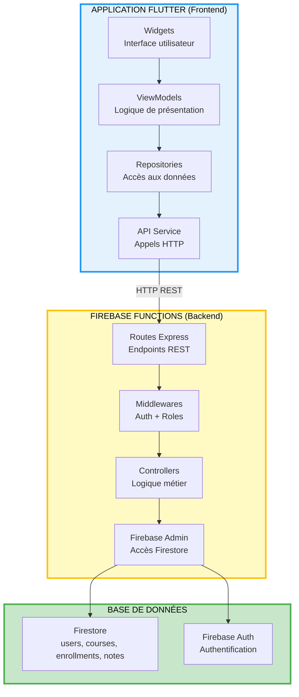
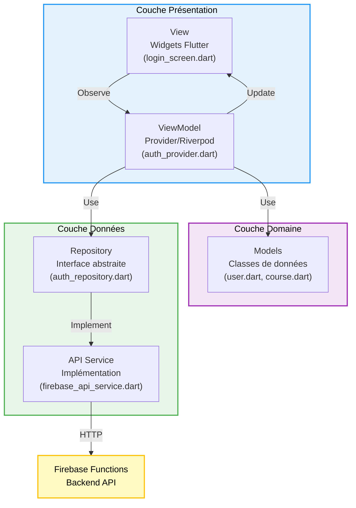
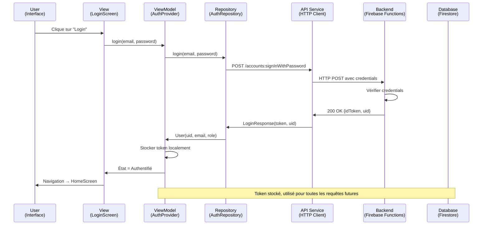
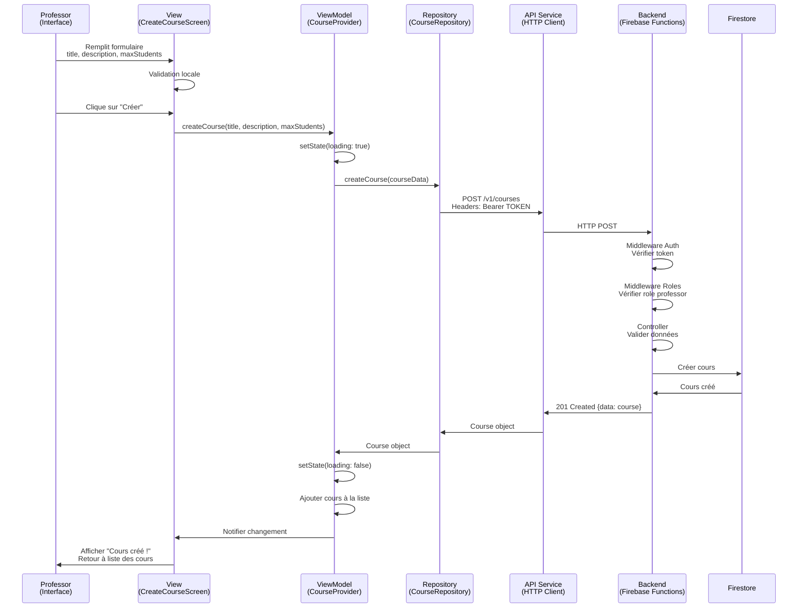
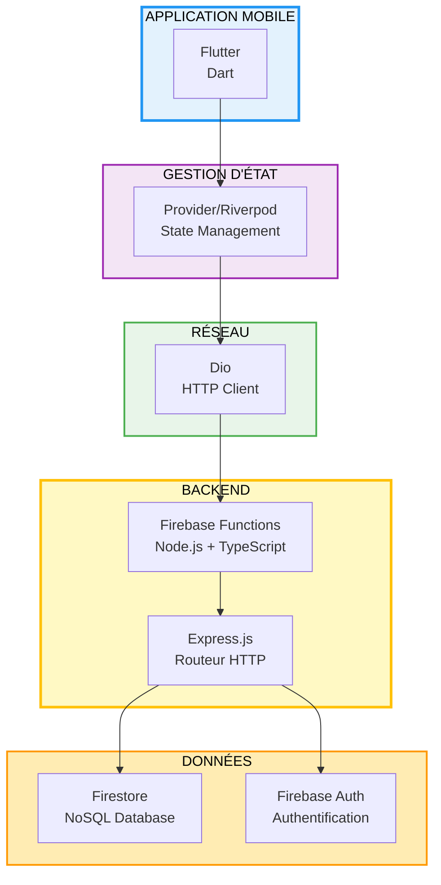
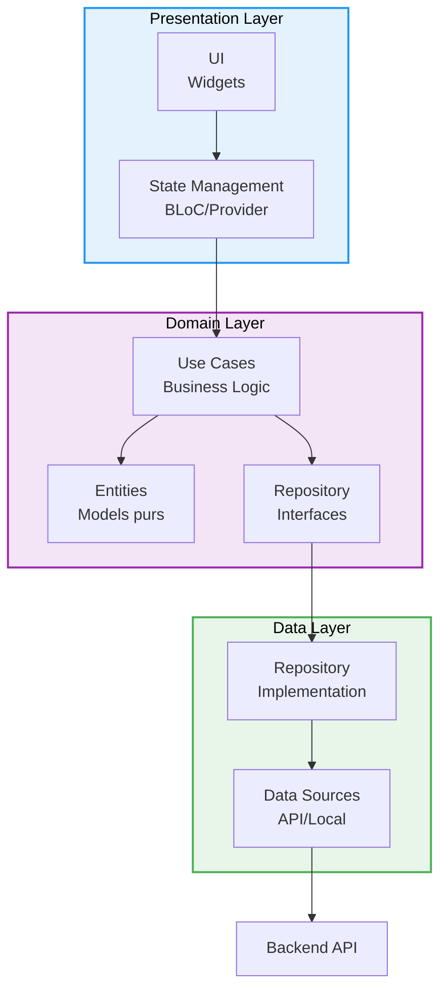

# Architecture Flutter + Firebase Functions

Guide technique pour développer une application Flutter avec Firebase Functions

---

## Table des matières

1. [Architecture Globale](#architecture-globale)
2. [Backend : Firebase Functions](#backend--firebase-functions)
3. [Frontend : Architecture Flutter](#frontend--architecture-flutter)
4. [Communication Backend-Frontend](#communication-backend-frontend)
5. [Structure des Dossiers](#structure-des-dossiers)
6. [Exemples de Code](#exemples-de-code)

---

## Architecture Globale

### Vue d'ensemble du système



### Principe de séparation

```
┌─────────────────────────────────────────────────────┐
│  FRONTEND (Flutter)                                 │
│  Responsabilité : Interface utilisateur             │
│  - Afficher les données                             │
│  - Gérer les interactions utilisateur               │
│  - Naviguer entre les écrans                        │
│  - Valider les formulaires (côté client)            │
└─────────────────────────────────────────────────────┘
                        ↕
                   HTTP REST
                   (JSON)
                        ↕
┌─────────────────────────────────────────────────────┐
│  BACKEND (Firebase Functions)                       │
│  Responsabilité : Logique métier et sécurité        │
│  - Authentifier les utilisateurs                    │
│  - Vérifier les permissions                         │
│  - Valider les données (côté serveur)               │
│  - Exécuter la logique métier                       │
│  - Accéder à la base de données                     │
└─────────────────────────────────────────────────────┘
                        ↕
┌─────────────────────────────────────────────────────┐
│  DATABASE (Firestore + Firebase Auth)               │
│  Responsabilité : Persistance des données           │
│  - Stocker les données                              │
│  - Gérer les utilisateurs (Auth)                    │
└─────────────────────────────────────────────────────┘
```

---

## Backend : Firebase Functions

### Architecture Actuelle (Ce Projet)

```
functions/
├── src/
│   ├── index.ts                    ← Point d'entrée (routes Express)
│   ├── firebase.ts                 ← Configuration Firebase Admin
│   ├── swagger.ts                  ← Documentation API
│   │
│   ├── middlewares/
│   │   ├── auth.ts                 ← Vérification JWT token
│   │   └── roles.ts                ← Vérification rôles (RBAC)
│   │
│   ├── controllers/
│   │   ├── authController.ts       ← Signup, Login
│   │   ├── userController.ts       ← CRUD Users (Admin)
│   │   ├── courseController.ts     ← CRUD Courses (Professor)
│   │   ├── enrollmentController.ts ← Inscriptions (Student)
│   │   └── noteController.ts       ← CRUD Notes (Tous)
│   │
│   └── types/
│       └── index.ts                ← Interfaces TypeScript
│
└── lib/                            ← Code compilé (généré auto)
```

### Pattern Utilisé : MVC Simplifié

```
Model (Types)  ←→  Controller (Logique)  ←→  View (Routes/Express)
```

- **Model** : Interfaces dans `types/index.ts`
- **Controller** : Logique métier dans `controllers/`
- **View** : Routes Express dans `index.ts`

---

## Frontend : Architecture Flutter

### Pattern Recommandé : MVVM (Model-View-ViewModel)



### Pourquoi MVVM ?

**Avantages :**
- Séparation claire entre UI et logique
- Testabilité (ViewModel peut être testé sans UI)
- Réutilisabilité (plusieurs screens peuvent utiliser le même ViewModel)
- Maintenance facile

**Alternative : Clean Architecture** (plus complexe mais plus scalable pour grandes apps)

---

## Communication Backend-Frontend

### Flux Complet : Login d'un Utilisateur



### Flux : Créer un Cours (Professor)



---

## Structure des Dossiers Flutter

### Architecture MVVM Recommandée

```
mon_app_flutter/
│
├── lib/
│   │
│   ├── main.dart                      ← Point d'entrée
│   │
│   ├── core/                          ← Code partagé
│   │   ├── constants/
│   │   │   └── api_constants.dart     ← URLs API
│   │   ├── utils/
│   │   │   └── validators.dart        ← Validation formulaires
│   │   └── widgets/
│   │       └── custom_button.dart     ← Widgets réutilisables
│   │
│   ├── data/                          ← Couche Données
│   │   ├── models/
│   │   │   ├── user.dart              ← Model User
│   │   │   ├── course.dart            ← Model Course
│   │   │   ├── enrollment.dart        ← Model Enrollment
│   │   │   └── note.dart              ← Model Note
│   │   │
│   │   ├── repositories/
│   │   │   ├── auth_repository.dart
│   │   │   ├── course_repository.dart
│   │   │   ├── enrollment_repository.dart
│   │   │   └── note_repository.dart
│   │   │
│   │   └── services/
│   │       ├── api_service.dart       ← Client HTTP (dio)
│   │       └── storage_service.dart   ← Stockage local token
│   │
│   ├── providers/                     ← ViewModels (Provider/Riverpod)
│   │   ├── auth_provider.dart
│   │   ├── course_provider.dart
│   │   ├── enrollment_provider.dart
│   │   └── note_provider.dart
│   │
│   └── screens/                       ← Interface utilisateur
│       ├── auth/
│       │   ├── login_screen.dart
│       │   └── signup_screen.dart
│       ├── courses/
│       │   ├── course_list_screen.dart
│       │   ├── course_detail_screen.dart
│       │   └── create_course_screen.dart
│       ├── enrollments/
│       │   └── my_enrollments_screen.dart
│       └── notes/
│           ├── note_list_screen.dart
│           └── create_note_screen.dart
│
├── pubspec.yaml                       ← Dépendances
└── README.md
```

---

## Exemples de Code Flutter

### 1. Model (Couche Domaine)

Fichier : `lib/data/models/course.dart`

```dart
class Course {
  final String id;
  final String title;
  final String description;
  final String professorUid;
  final String professorName;
  final int maxStudents;
  final int currentStudents;
  final int createdAt;
  final int updatedAt;

  Course({
    required this.id,
    required this.title,
    required this.description,
    required this.professorUid,
    required this.professorName,
    required this.maxStudents,
    required this.currentStudents,
    required this.createdAt,
    required this.updatedAt,
  });

  // Conversion JSON → Dart object
  factory Course.fromJson(Map<String, dynamic> json) {
    return Course(
      id: json['id'] as String,
      title: json['title'] as String,
      description: json['description'] as String,
      professorUid: json['professorUid'] as String,
      professorName: json['professorName'] as String,
      maxStudents: json['maxStudents'] as int,
      currentStudents: json['currentStudents'] as int,
      createdAt: json['createdAt'] as int,
      updatedAt: json['updatedAt'] as int,
    );
  }

  // Conversion Dart object → JSON
  Map<String, dynamic> toJson() {
    return {
      'id': id,
      'title': title,
      'description': description,
      'professorUid': professorUid,
      'professorName': professorName,
      'maxStudents': maxStudents,
      'currentStudents': currentStudents,
      'createdAt': createdAt,
      'updatedAt': updatedAt,
    };
  }
}
```

---

### 2. API Service (Couche Données)

Fichier : `lib/data/services/api_service.dart`

```dart
import 'package:dio/dio.dart';

class ApiService {
  final Dio _dio;
  final String baseUrl = 'http://localhost:5001/backend-demo-1/us-central1/api';
  
  // Singleton pattern
  static final ApiService _instance = ApiService._internal();
  factory ApiService() => _instance;
  
  ApiService._internal() : _dio = Dio(BaseOptions(
    baseUrl: 'http://localhost:5001/backend-demo-1/us-central1/api',
    connectTimeout: const Duration(seconds: 5),
    receiveTimeout: const Duration(seconds: 3),
    headers: {
      'Content-Type': 'application/json',
    },
  ));

  // Setter pour le token JWT
  void setToken(String token) {
    _dio.options.headers['Authorization'] = 'Bearer $token';
  }

  // Méthode POST générique
  Future<Response> post(String path, Map<String, dynamic> data) async {
    try {
      final response = await _dio.post(path, data: data);
      return response;
    } on DioException catch (e) {
      throw _handleError(e);
    }
  }

  // Méthode GET générique
  Future<Response> get(String path, {Map<String, dynamic>? queryParams}) async {
    try {
      final response = await _dio.get(path, queryParameters: queryParams);
      return response;
    } on DioException catch (e) {
      throw _handleError(e);
    }
  }

  // Méthode PUT générique
  Future<Response> put(String path, Map<String, dynamic> data) async {
    try {
      final response = await _dio.put(path, data: data);
      return response;
    } on DioException catch (e) {
      throw _handleError(e);
    }
  }

  // Méthode DELETE générique
  Future<Response> delete(String path) async {
    try {
      final response = await _dio.delete(path);
      return response;
    } on DioException catch (e) {
      throw _handleError(e);
    }
  }

  // Gestion des erreurs
  Exception _handleError(DioException error) {
    if (error.response != null) {
      // Erreur du serveur (400, 401, 403, 404, etc.)
      final statusCode = error.response!.statusCode;
      final message = error.response!.data['error'] ?? 'Erreur inconnue';
      
      switch (statusCode) {
        case 401:
          return Exception('Non authentifié: $message');
        case 403:
          return Exception('Accès interdit: $message');
        case 404:
          return Exception('Ressource non trouvée: $message');
        case 422:
          return Exception('Validation échouée: $message');
        default:
          return Exception('Erreur $statusCode: $message');
      }
    } else {
      // Erreur réseau
      return Exception('Erreur réseau: ${error.message}');
    }
  }
}
```

---

### 3. Repository (Couche Données)

Fichier : `lib/data/repositories/course_repository.dart`

```dart
import '../models/course.dart';
import '../services/api_service.dart';

class CourseRepository {
  final ApiService _apiService = ApiService();

  // Créer un cours
  Future<Course> createCourse({
    required String title,
    required String description,
    required int maxStudents,
  }) async {
    final response = await _apiService.post(
      '/v1/courses',
      {
        'title': title,
        'description': description,
        'maxStudents': maxStudents,
      },
    );

    return Course.fromJson(response.data['data']);
  }

  // Lister tous les cours
  Future<List<Course>> getAllCourses() async {
    final response = await _apiService.get('/v1/courses');
    
    final List<dynamic> coursesJson = response.data['data'];
    return coursesJson.map((json) => Course.fromJson(json)).toList();
  }

  // Lire un cours spécifique
  Future<Course> getCourse(String courseId) async {
    final response = await _apiService.get('/v1/courses/$courseId');
    return Course.fromJson(response.data['data']);
  }

  // Modifier un cours
  Future<Course> updateCourse({
    required String courseId,
    required String title,
    required String description,
    required int maxStudents,
  }) async {
    final response = await _apiService.put(
      '/v1/courses/$courseId',
      {
        'title': title,
        'description': description,
        'maxStudents': maxStudents,
      },
    );

    return Course.fromJson(response.data['data']);
  }

  // Supprimer un cours
  Future<void> deleteCourse(String courseId) async {
    await _apiService.delete('/v1/courses/$courseId');
  }

  // Lister MES cours (professeur)
  Future<List<Course>> getMyCourses() async {
    final response = await _apiService.get('/v1/courses/my');
    
    final List<dynamic> coursesJson = response.data['data'];
    return coursesJson.map((json) => Course.fromJson(json)).toList();
  }
}
```

---

### 4. ViewModel/Provider (Couche Présentation)

Fichier : `lib/providers/course_provider.dart`

```dart
import 'package:flutter/foundation.dart';
import '../data/models/course.dart';
import '../data/repositories/course_repository.dart';

class CourseProvider extends ChangeNotifier {
  final CourseRepository _repository = CourseRepository();
  
  List<Course> _courses = [];
  List<Course> get courses => _courses;
  
  bool _isLoading = false;
  bool get isLoading => _isLoading;
  
  String? _errorMessage;
  String? get errorMessage => _errorMessage;

  // Charger tous les cours
  Future<void> loadCourses() async {
    _isLoading = true;
    _errorMessage = null;
    notifyListeners();

    try {
      _courses = await _repository.getAllCourses();
      _isLoading = false;
      notifyListeners();
    } catch (e) {
      _errorMessage = e.toString();
      _isLoading = false;
      notifyListeners();
    }
  }

  // Créer un cours
  Future<bool> createCourse({
    required String title,
    required String description,
    required int maxStudents,
  }) async {
    _isLoading = true;
    _errorMessage = null;
    notifyListeners();

    try {
      final newCourse = await _repository.createCourse(
        title: title,
        description: description,
        maxStudents: maxStudents,
      );
      
      _courses.add(newCourse);
      _isLoading = false;
      notifyListeners();
      return true;
    } catch (e) {
      _errorMessage = e.toString();
      _isLoading = false;
      notifyListeners();
      return false;
    }
  }

  // Modifier un cours
  Future<bool> updateCourse({
    required String courseId,
    required String title,
    required String description,
    required int maxStudents,
  }) async {
    _isLoading = true;
    notifyListeners();

    try {
      final updatedCourse = await _repository.updateCourse(
        courseId: courseId,
        title: title,
        description: description,
        maxStudents: maxStudents,
      );
      
      // Mettre à jour la liste locale
      final index = _courses.indexWhere((c) => c.id == courseId);
      if (index != -1) {
        _courses[index] = updatedCourse;
      }
      
      _isLoading = false;
      notifyListeners();
      return true;
    } catch (e) {
      _errorMessage = e.toString();
      _isLoading = false;
      notifyListeners();
      return false;
    }
  }

  // Supprimer un cours
  Future<bool> deleteCourse(String courseId) async {
    try {
      await _repository.deleteCourse(courseId);
      _courses.removeWhere((c) => c.id == courseId);
      notifyListeners();
      return true;
    } catch (e) {
      _errorMessage = e.toString();
      notifyListeners();
      return false;
    }
  }
}
```

---

### 5. View/Screen (Couche Présentation)

Fichier : `lib/screens/courses/course_list_screen.dart`

```dart
import 'package:flutter/material.dart';
import 'package:provider/provider.dart';
import '../../providers/course_provider.dart';

class CourseListScreen extends StatefulWidget {
  @override
  _CourseListScreenState createState() => _CourseListScreenState();
}

class _CourseListScreenState extends State<CourseListScreen> {
  @override
  void initState() {
    super.initState();
    // Charger les cours au démarrage
    Future.microtask(() {
      context.read<CourseProvider>().loadCourses();
    });
  }

  @override
  Widget build(BuildContext context) {
    return Scaffold(
      appBar: AppBar(
        title: Text('Liste des Cours'),
      ),
      body: Consumer<CourseProvider>(
        builder: (context, courseProvider, child) {
          // Afficher un loader pendant le chargement
          if (courseProvider.isLoading) {
            return Center(child: CircularProgressIndicator());
          }

          // Afficher une erreur s'il y en a une
          if (courseProvider.errorMessage != null) {
            return Center(
              child: Text(
                'Erreur: ${courseProvider.errorMessage}',
                style: TextStyle(color: Colors.red),
              ),
            );
          }

          // Afficher la liste des cours
          final courses = courseProvider.courses;

          if (courses.isEmpty) {
            return Center(child: Text('Aucun cours disponible'));
          }

          return ListView.builder(
            itemCount: courses.length,
            itemBuilder: (context, index) {
              final course = courses[index];
              return Card(
                margin: EdgeInsets.all(8),
                child: ListTile(
                  title: Text(course.title),
                  subtitle: Text(
                    '${course.description}\n'
                    'Professeur: ${course.professorName}\n'
                    'Étudiants: ${course.currentStudents}/${course.maxStudents}',
                  ),
                  isThreeLine: true,
                  trailing: Icon(Icons.arrow_forward),
                  onTap: () {
                    // Navigation vers les détails
                    Navigator.pushNamed(
                      context,
                      '/course-detail',
                      arguments: course.id,
                    );
                  },
                ),
              );
            },
          );
        },
      ),
      floatingActionButton: FloatingActionButton(
        onPressed: () {
          Navigator.pushNamed(context, '/create-course');
        },
        child: Icon(Icons.add),
      ),
    );
  }
}
```

---

### 6. Gestion de l'Authentification

Fichier : `lib/providers/auth_provider.dart`

```dart
import 'package:flutter/foundation.dart';
import '../data/models/user.dart';
import '../data/repositories/auth_repository.dart';
import '../data/services/api_service.dart';
import '../data/services/storage_service.dart';

class AuthProvider extends ChangeNotifier {
  final AuthRepository _repository = AuthRepository();
  final StorageService _storage = StorageService();
  final ApiService _apiService = ApiService();
  
  User? _currentUser;
  User? get currentUser => _currentUser;
  
  bool _isAuthenticated = false;
  bool get isAuthenticated => _isAuthenticated;
  
  String? _token;
  
  // Initialiser au démarrage de l'app
  Future<void> init() async {
    // Récupérer le token stocké localement
    _token = await _storage.getToken();
    
    if (_token != null) {
      _apiService.setToken(_token!);
      
      try {
        // Vérifier que le token est toujours valide
        _currentUser = await _repository.getProfile();
        _isAuthenticated = true;
        notifyListeners();
      } catch (e) {
        // Token expiré, déconnecter
        await logout();
      }
    }
  }

  // Login
  Future<bool> login(String email, String password) async {
    try {
      final result = await _repository.login(email, password);
      
      _token = result['token'];
      _currentUser = result['user'];
      _isAuthenticated = true;
      
      // Stocker le token localement
      await _storage.saveToken(_token!);
      _apiService.setToken(_token!);
      
      notifyListeners();
      return true;
    } catch (e) {
      notifyListeners();
      return false;
    }
  }

  // Signup
  Future<bool> signup({
    required String email,
    required String password,
    required String role,
    required String firstName,
    required String lastName,
  }) async {
    try {
      final user = await _repository.signup(
        email: email,
        password: password,
        role: role,
        firstName: firstName,
        lastName: lastName,
      );
      
      return true;
    } catch (e) {
      return false;
    }
  }

  // Logout
  Future<void> logout() async {
    _token = null;
    _currentUser = null;
    _isAuthenticated = false;
    
    await _storage.clearToken();
    _apiService.setToken('');
    
    notifyListeners();
  }

  // Vérifier le rôle
  bool hasRole(String role) {
    return _currentUser?.role == role;
  }

  bool isAdmin() => hasRole('admin');
  bool isProfessor() => hasRole('professor');
  bool isStudent() => hasRole('student');
}
```

---

### 7. Storage Service (Stockage Local du Token)

Fichier : `lib/data/services/storage_service.dart`

```dart
import 'package:shared_preferences/shared_preferences.dart';

class StorageService {
  static const String _tokenKey = 'auth_token';

  // Sauvegarder le token
  Future<void> saveToken(String token) async {
    final prefs = await SharedPreferences.getInstance();
    await prefs.setString(_tokenKey, token);
  }

  // Récupérer le token
  Future<String?> getToken() async {
    final prefs = await SharedPreferences.getInstance();
    return prefs.getString(_tokenKey);
  }

  // Supprimer le token
  Future<void> clearToken() async {
    final prefs = await SharedPreferences.getInstance();
    await prefs.remove(_tokenKey);
  }
}
```

---

### 8. Repository Auth (Couche Données)

Fichier : `lib/data/repositories/auth_repository.dart`

```dart
import '../models/user.dart';
import '../services/api_service.dart';

class AuthRepository {
  final ApiService _apiService = ApiService();
  final String _authUrl = 'http://localhost:9099/identitytoolkit.googleapis.com/v1';

  // Signup
  Future<User> signup({
    required String email,
    required String password,
    required String role,
    required String firstName,
    required String lastName,
  }) async {
    final response = await _apiService.post(
      '/v1/auth/signup',
      {
        'email': email,
        'password': password,
        'role': role,
        'firstName': firstName,
        'lastName': lastName,
      },
    );

    return User.fromJson(response.data['data']);
  }

  // Login (en 2 étapes avec Firebase Auth Emulator)
  Future<Map<String, dynamic>> login(String email, String password) async {
    // Étape 1 : Obtenir le token de Firebase Auth
    final authResponse = await _apiService.post(
      '$_authUrl/accounts:signInWithPassword?key=anything',
      {
        'email': email,
        'password': password,
        'returnSecureToken': true,
      },
    );

    final token = authResponse.data['idToken'];

    // Étape 2 : Récupérer le profil avec le token
    _apiService.setToken(token);
    
    final profileResponse = await _apiService.get('/v1/profile');
    final user = User.fromJson(profileResponse.data['data']);

    return {
      'token': token,
      'user': user,
    };
  }

  // Récupérer le profil
  Future<User> getProfile() async {
    final response = await _apiService.get('/v1/profile');
    return User.fromJson(response.data['data']);
  }

  // Mettre à jour le profil
  Future<User> updateProfile({
    required String firstName,
    required String lastName,
  }) async {
    final response = await _apiService.put(
      '/v1/profile',
      {
        'firstName': firstName,
        'lastName': lastName,
      },
    );

    return User.fromJson(response.data['data']);
  }
}
```

---

### 9. Screen Login (Interface Utilisateur)

Fichier : `lib/screens/auth/login_screen.dart`

```dart
import 'package:flutter/material.dart';
import 'package:provider/provider.dart';
import '../../providers/auth_provider.dart';

class LoginScreen extends StatefulWidget {
  @override
  _LoginScreenState createState() => _LoginScreenState();
}

class _LoginScreenState extends State<LoginScreen> {
  final _formKey = GlobalKey<FormState>();
  final _emailController = TextEditingController();
  final _passwordController = TextEditingController();
  bool _isLoading = false;

  Future<void> _handleLogin() async {
    if (!_formKey.currentState!.validate()) {
      return;
    }

    setState(() => _isLoading = true);

    final authProvider = context.read<AuthProvider>();
    
    final success = await authProvider.login(
      _emailController.text.trim(),
      _passwordController.text,
    );

    setState(() => _isLoading = false);

    if (success) {
      // Navigation selon le rôle
      final user = authProvider.currentUser!;
      
      if (user.role == 'admin') {
        Navigator.pushReplacementNamed(context, '/admin-home');
      } else if (user.role == 'professor') {
        Navigator.pushReplacementNamed(context, '/professor-home');
      } else {
        Navigator.pushReplacementNamed(context, '/student-home');
      }
    } else {
      ScaffoldMessenger.of(context).showSnackBar(
        SnackBar(content: Text('Login échoué. Vérifiez vos identifiants.')),
      );
    }
  }

  @override
  Widget build(BuildContext context) {
    return Scaffold(
      appBar: AppBar(title: Text('Connexion')),
      body: Padding(
        padding: EdgeInsets.all(16),
        child: Form(
          key: _formKey,
          child: Column(
            mainAxisAlignment: MainAxisAlignment.center,
            children: [
              // Email
              TextFormField(
                controller: _emailController,
                decoration: InputDecoration(
                  labelText: 'Email',
                  prefixIcon: Icon(Icons.email),
                ),
                keyboardType: TextInputType.emailAddress,
                validator: (value) {
                  if (value == null || value.isEmpty) {
                    return 'Email requis';
                  }
                  if (!value.contains('@')) {
                    return 'Email invalide';
                  }
                  return null;
                },
              ),
              
              SizedBox(height: 16),
              
              // Password
              TextFormField(
                controller: _passwordController,
                decoration: InputDecoration(
                  labelText: 'Mot de passe',
                  prefixIcon: Icon(Icons.lock),
                ),
                obscureText: true,
                validator: (value) {
                  if (value == null || value.isEmpty) {
                    return 'Mot de passe requis';
                  }
                  if (value.length < 6) {
                    return 'Minimum 6 caractères';
                  }
                  return null;
                },
              ),
              
              SizedBox(height: 24),
              
              // Bouton Login
              ElevatedButton(
                onPressed: _isLoading ? null : _handleLogin,
                child: _isLoading
                    ? CircularProgressIndicator()
                    : Text('Se connecter'),
              ),
              
              // Lien vers Signup
              TextButton(
                onPressed: () {
                  Navigator.pushNamed(context, '/signup');
                },
                child: Text('Créer un compte'),
              ),
            ],
          ),
        ),
      ),
    );
  }

  @override
  void dispose() {
    _emailController.dispose();
    _passwordController.dispose();
    super.dispose();
  }
}
```

---

### 10. Main.dart (Configuration)

Fichier : `lib/main.dart`

```dart
import 'package:flutter/material.dart';
import 'package:provider/provider.dart';

import 'providers/auth_provider.dart';
import 'providers/course_provider.dart';
import 'providers/enrollment_provider.dart';
import 'providers/note_provider.dart';

import 'screens/auth/login_screen.dart';
import 'screens/auth/signup_screen.dart';
import 'screens/courses/course_list_screen.dart';
import 'screens/courses/create_course_screen.dart';

void main() {
  runApp(MyApp());
}

class MyApp extends StatelessWidget {
  @override
  Widget build(BuildContext context) {
    return MultiProvider(
      providers: [
        ChangeNotifierProvider(create: (_) => AuthProvider()),
        ChangeNotifierProvider(create: (_) => CourseProvider()),
        ChangeNotifierProvider(create: (_) => EnrollmentProvider()),
        ChangeNotifierProvider(create: (_) => NoteProvider()),
      ],
      child: MaterialApp(
        title: 'School Management',
        theme: ThemeData(
          primarySwatch: Colors.blue,
        ),
        initialRoute: '/login',
        routes: {
          '/login': (context) => LoginScreen(),
          '/signup': (context) => SignupScreen(),
          '/admin-home': (context) => AdminHomeScreen(),
          '/professor-home': (context) => ProfessorHomeScreen(),
          '/student-home': (context) => StudentHomeScreen(),
          '/courses': (context) => CourseListScreen(),
          '/create-course': (context) => CreateCourseScreen(),
        },
      ),
    );
  }
}
```

---

## Dépendances Flutter (pubspec.yaml)

```yaml
name: school_management_app
description: Application de gestion scolaire avec Firebase Functions

dependencies:
  flutter:
    sdk: flutter
  
  # State Management
  provider: ^6.1.1
  
  # HTTP Client
  dio: ^5.4.0
  
  # Stockage Local
  shared_preferences: ^2.2.2
  
  # Navigation
  go_router: ^13.0.0
  
  # UI
  flutter_svg: ^2.0.9
  
dev_dependencies:
  flutter_test:
    sdk: flutter
  flutter_lints: ^3.0.1
```

---

## Architecture Complète Visualisée

### Stack Technologique



---

## Patterns Architecturaux

### Pattern 1 : MVVM (Recommandé)

**Model-View-ViewModel**

```
View (Widget)
    ↓ observe
ViewModel (Provider)
    ↓ use
Model (Class)
    ↓ use
Repository
    ↓ use
API Service
    ↓ HTTP
Backend
```

**Avantages :**
- Simple à comprendre
- Bon pour petites/moyennes apps
- Provider intégré dans Flutter
- Séparation UI/Logique

**Inconvénients :**
- Peut devenir complexe si app très grande

---

### Pattern 2 : Clean Architecture (Avancé)

**Pour applications complexes**



**Avantages :**
- Très scalable
- Testabilité maximale
- Indépendance des couches

**Inconvénients :**
- Plus complexe
- Plus de fichiers (boilerplate)
- Nécessite plus d'expérience

---

## Comparaison des Architectures

### Pour votre Projet (School Management)

| Architecture | Complexité | Fichiers | Courbe apprentissage | Recommandé pour |
|--------------|-----------|----------|---------------------|-----------------|
| **MVVM** | Moyenne | ~40 | Facile | Petites/Moyennes apps |
| **Clean Architecture** | Élevée | ~80 | Difficile | Grandes apps, équipes |
| **MVC Basique** | Faible | ~20 | Très facile | Prototypes |

**Recommandation : MVVM avec Provider**

Raisons :
1. Assez simple pour démarrer
2. Scalable pour ajouter des features
3. Bien documenté
4. Utilisé par la communauté Flutter

---

## Flux de Données

### Créer un Cours (Exemple Complet)

```mermaid
graph LR
    User["1. User<br/>Remplit formulaire"]
    Widget["2. CreateCourseScreen<br/>Validation locale"]
    Provider["3. CourseProvider<br/>createCourse()"]
    Repo["4. CourseRepository<br/>Appelle API"]
    API["5. ApiService<br/>HTTP POST"]
    Backend["6. Firebase Functions<br/>Traite requête"]
    DB["7. Firestore<br/>Sauvegarde"]
    
    User --> Widget
    Widget --> Provider
    Provider --> Repo
    Repo --> API
    API --> Backend
    Backend --> DB
    
    DB -->|Course créé| Backend
    Backend -->|201 + data| API
    API -->|Course object| Repo
    Repo -->|Course object| Provider
    Provider -->|Notify| Widget
    Widget -->|Affiche success| User
    
    style User fill:#FFE082,color:#000,stroke:#333,stroke-width:2px
    style Widget fill:#E3F2FD,color:#000,stroke:#2196F3,stroke-width:2px
    style Provider fill:#F3E5F5,color:#000,stroke:#9C27B0,stroke-width:2px
    style Repo fill:#E8F5E9,color:#000,stroke:#4CAF50,stroke-width:2px
    style API fill:#FFF9C4,color:#000,stroke:#FFC107,stroke-width:2px
    style Backend fill:#FFECB3,color:#000,stroke:#FF9800,stroke-width:2px
    style DB fill:#C8E6C9,color:#000,stroke:#4CAF50,stroke-width:2px
```



---

## Organisation Recommandée

### Structure Minimale (MVVM)

```
lib/
├── main.dart
│
├── data/
│   ├── models/                     ← Classes de données
│   │   ├── user.dart
│   │   ├── course.dart
│   │   ├── enrollment.dart
│   │   └── note.dart
│   │
│   ├── repositories/               ← Accès aux données
│   │   ├── auth_repository.dart
│   │   ├── course_repository.dart
│   │   ├── enrollment_repository.dart
│   │   └── note_repository.dart
│   │
│   └── services/                   ← Services techniques
│       ├── api_service.dart        ← Client HTTP
│       └── storage_service.dart    ← Stockage local
│
├── providers/                      ← ViewModels (State)
│   ├── auth_provider.dart
│   ├── course_provider.dart
│   ├── enrollment_provider.dart
│   └── note_provider.dart
│
└── screens/                        ← Interface utilisateur
    ├── auth/
    │   ├── login_screen.dart
    │   └── signup_screen.dart
    ├── admin/
    │   └── admin_home_screen.dart
    ├── professor/
    │   ├── professor_home_screen.dart
    │   ├── my_courses_screen.dart
    │   └── create_course_screen.dart
    └── student/
        ├── student_home_screen.dart
        ├── course_list_screen.dart
        └── my_enrollments_screen.dart
```

---

## Bonnes Pratiques

### 1. Séparation des Responsabilités

```
NE PAS FAIRE :
❌ Appeler l'API directement depuis un Widget
❌ Mettre la logique métier dans les Widgets
❌ Accéder directement à Firestore depuis Flutter

FAIRE :
✅ Widget → Provider → Repository → API → Backend
✅ Chaque couche a SA responsabilité
✅ Passer par l'API Backend pour tout
```

### 2. Gestion des Erreurs

```dart
// Dans le Repository
try {
  final response = await _apiService.post('/v1/courses', data);
  return Course.fromJson(response.data['data']);
} catch (e) {
  // Logger l'erreur
  print('Error creating course: $e');
  // Propager l'erreur au Provider
  rethrow;
}

// Dans le Provider
try {
  final course = await _repository.createCourse(...);
  _courses.add(course);
  notifyListeners();
  return true;
} catch (e) {
  _errorMessage = e.toString();
  notifyListeners();
  return false;
}

// Dans le Widget
final success = await provider.createCourse(...);
if (success) {
  ScaffoldMessenger.of(context).showSnackBar(
    SnackBar(content: Text('Cours créé avec succès')),
  );
} else {
  ScaffoldMessenger.of(context).showSnackBar(
    SnackBar(content: Text('Erreur: ${provider.errorMessage}')),
  );
}
```

### 3. Gestion du Token JWT

```dart
// Au login
await _storage.saveToken(token);
_apiService.setToken(token);

// Au démarrage de l'app
final token = await _storage.getToken();
if (token != null) {
  _apiService.setToken(token);
  // Vérifier que le token est valide
  await _repository.getProfile();
}

// Au logout
await _storage.clearToken();
_apiService.setToken('');
```

### 4. Navigation par Rôle

```dart
// Après login, naviguer selon le rôle
if (user.role == 'admin') {
  Navigator.pushReplacementNamed(context, '/admin-home');
} else if (user.role == 'professor') {
  Navigator.pushReplacementNamed(context, '/professor-home');
} else if (user.role == 'student') {
  Navigator.pushReplacementNamed(context, '/student-home');
}
```

---

## Résumé Architecture

### Ce qui est dans le Backend (Firebase Functions)

```
✅ Authentification (vérifier token JWT)
✅ Autorisation (vérifier rôles)
✅ Validation des données (côté serveur)
✅ Logique métier (inscriptions, cours, etc.)
✅ Accès à Firestore
✅ Sécurité
```

### Ce qui est dans le Frontend (Flutter)

```
✅ Interface utilisateur (Widgets)
✅ Gestion d'état (Provider)
✅ Validation formulaires (côté client)
✅ Navigation
✅ Appels HTTP à l'API
✅ Stockage local du token
```

### Ce qui est partagé

```
✅ Modèles de données (même structure JSON)
   - Backend : TypeScript interfaces
   - Frontend : Dart classes
```

---

## Checklist Développement Flutter

### Phase 1 : Setup

- [ ] Créer projet Flutter
- [ ] Ajouter dépendances (provider, dio, shared_preferences)
- [ ] Créer structure des dossiers

### Phase 2 : Data Layer

- [ ] Créer models (User, Course, Enrollment, Note)
- [ ] Créer ApiService (client HTTP)
- [ ] Créer StorageService (token)
- [ ] Créer repositories

### Phase 3 : Providers

- [ ] Créer AuthProvider
- [ ] Créer CourseProvider
- [ ] Créer EnrollmentProvider
- [ ] Créer NoteProvider

### Phase 4 : UI

- [ ] Créer LoginScreen
- [ ] Créer SignupScreen
- [ ] Créer écrans selon le rôle (Admin/Prof/Student)
- [ ] Tester avec le backend

---

## Commandes Essentielles

### Backend (Firebase Functions)

```bash
# Démarrer les émulateurs
npm run serve

# URLs backend
http://localhost:5001/backend-demo-1/us-central1/api
http://localhost:9099  (Auth Emulator)
```

### Frontend (Flutter)

```bash
# Créer le projet
flutter create school_management_app

# Installer dépendances
flutter pub get

# Lancer l'app
flutter run

# Build
flutter build apk  (Android)
flutter build ios  (iOS)
```

---

## Conclusion

### Architecture Finale

```
FLUTTER APP (Frontend)
    ↓
Provider (State Management)
    ↓
Repository (Data Access)
    ↓
API Service (HTTP Client)
    ↓
Firebase Functions (Backend)
    ↓
Firestore (Database)
```

### Principe Clé

**NE JAMAIS accéder directement à Firestore depuis Flutter**

**TOUJOURS passer par Firebase Functions (API REST)**

Pourquoi ?
- Sécurité centralisée
- Validation côté serveur
- Logique métier protégée
- Code réutilisable
- Une seule source de vérité

---

**Date** : 6 octobre 2025  
**Version** : 1.0  
**Projet** : Architecture Flutter + Firebase Functions  
**Pattern** : MVVM avec Provider

